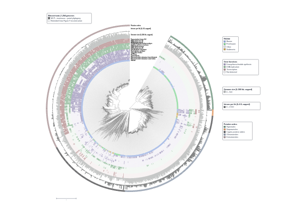
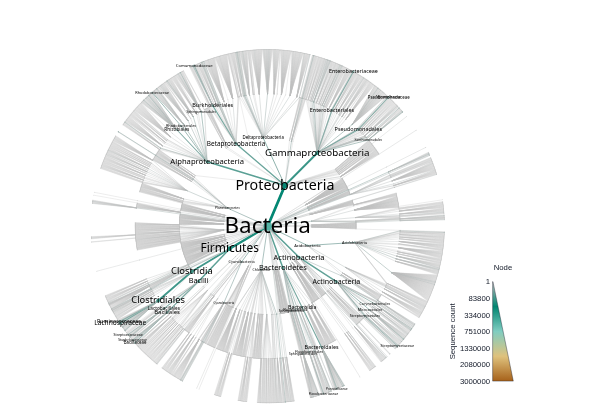
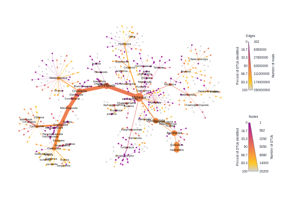
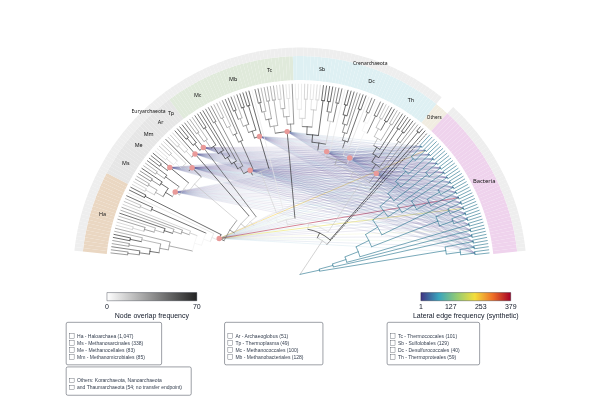
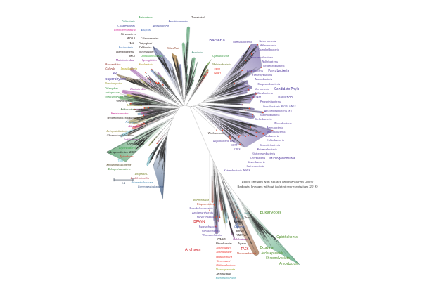
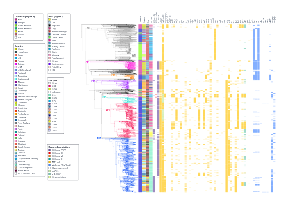
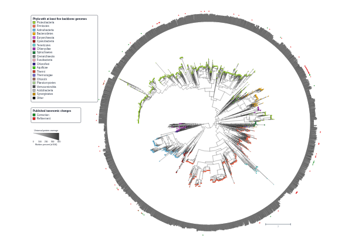
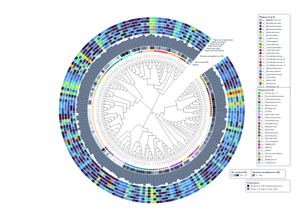
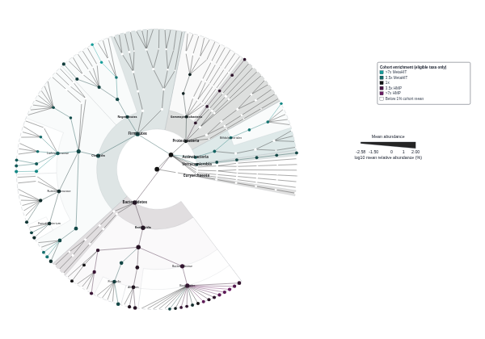

# TreeViz

View, annotate and edit phylogenetic trees in your browser. Add metadata, choose
a rectangular, circular or radial layout, and export SVG, PNG or PDF figures.
Save your work as an editable session.

**[Open TreeViz](https://treeviz.newlineages.com/)** ·
**[Documentation](https://fmschulz.github.io/treeviz/)** ·
[Getting started](https://fmschulz.github.io/treeviz/GETTING_STARTED/)

## Examples

Click a preview to open its session. See the [examples guide](https://fmschulz.github.io/treeviz/EXAMPLES/)
for source data, methods and reconstruction limits.

<table>
  <tr>
    <td width="33%" align="center">
       
      <a href="https://treeviz.newlineages.com/?session=/examples/example-1-mirusviricota/session.treeviz.json">1. Mirusviricota</a>
    </td>
    <td width="33%" align="center">
       
      <a href="https://treeviz.newlineages.com/?session=/examples/example-2-silva/session.treeviz.json">2. SILVA taxonomy</a>
    </td>
    <td width="33%" align="center">
       
      <a href="https://treeviz.newlineages.com/?session=/examples/example-3-tara-metazoa/session.treeviz.json">3. TARA Oceans Metazoa</a>
    </td>
  </tr>
  <tr>
    <td width="33%" align="center">
       
      <a href="https://treeviz.newlineages.com/?session=/examples/example-4-archaeal-acquisitions/session.treeviz.json">4. Archaeal gene acquisitions</a>
    </td>
    <td width="33%" align="center">
       
      <a href="https://treeviz.newlineages.com/?session=/examples/example-5-tree-of-life/session.treeviz.json">5. Tree of life</a>
    </td>
    <td width="33%" align="center">
       
      <a href="https://treeviz.newlineages.com/?session=/examples/example-6-cc398/session.treeviz.json">6. S. aureus CC398</a>
    </td>
  </tr>
  <tr>
    <td width="33%" align="center">
       
      <a href="https://treeviz.newlineages.com/?session=/examples/example-7-phylophlan/session.treeviz.json">7. PhyloPhlAn tree of life</a>
    </td>
    <td width="33%" align="center">
       
      <a href="https://treeviz.newlineages.com/?session=/examples/example-8-reactor-stability/session.treeviz.json">8. Bioreactor MAGs</a>
    </td>
    <td width="33%" align="center">
       
      <a href="https://treeviz.newlineages.com/?session=/examples/example-9-metaphlan/session.treeviz.json">9. HMP and MetaHIT microbiota</a>
    </td>
  </tr>
</table>

Guides: [browser](https://fmschulz.github.io/treeviz/BROWSER/),
[Python](https://fmschulz.github.io/treeviz/PYTHON/) and
[agent automation](https://fmschulz.github.io/treeviz/AGENTS/).

This repository contains the public documentation, example scripts and agent
skill. The application source is maintained separately.
