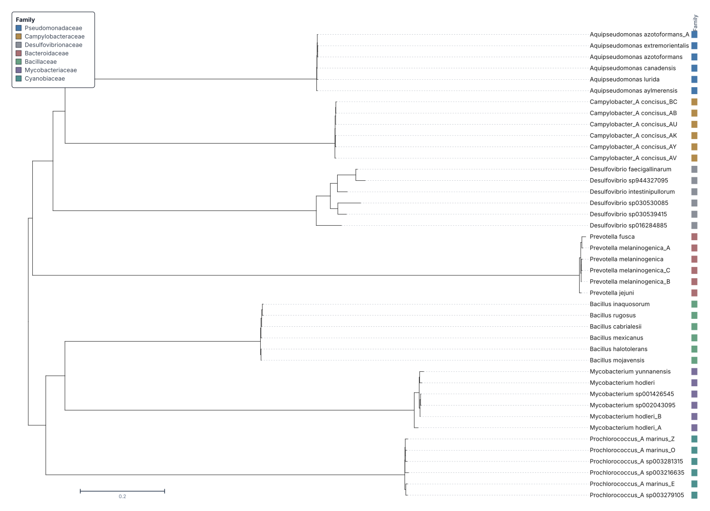
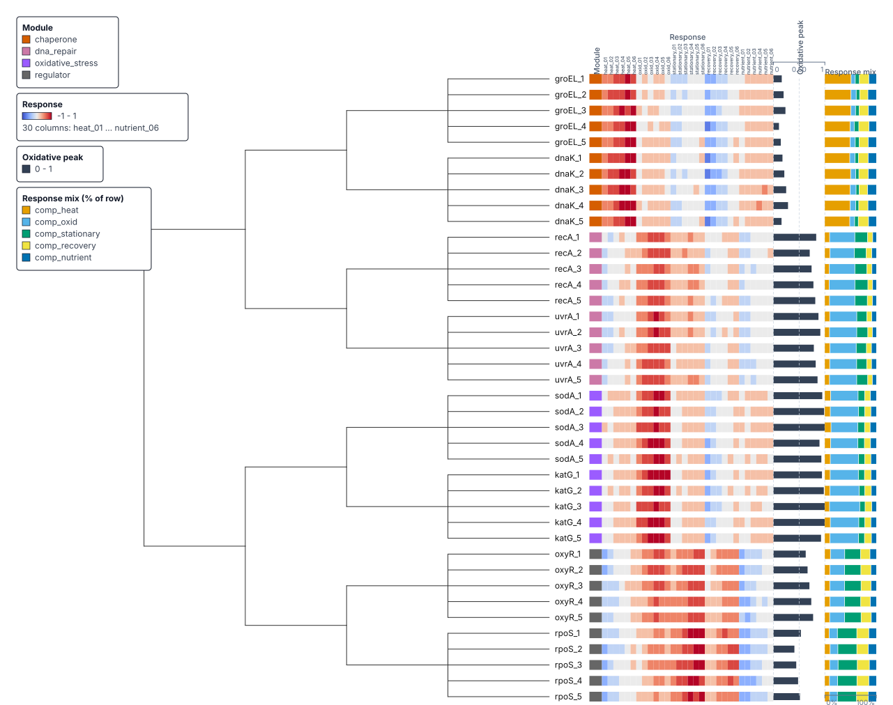
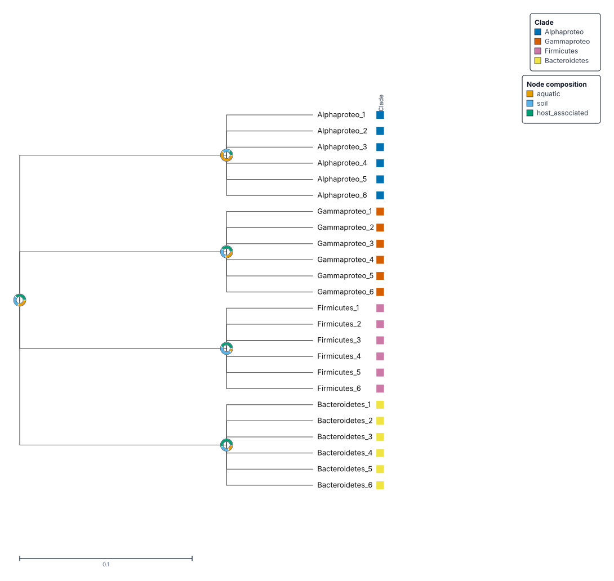
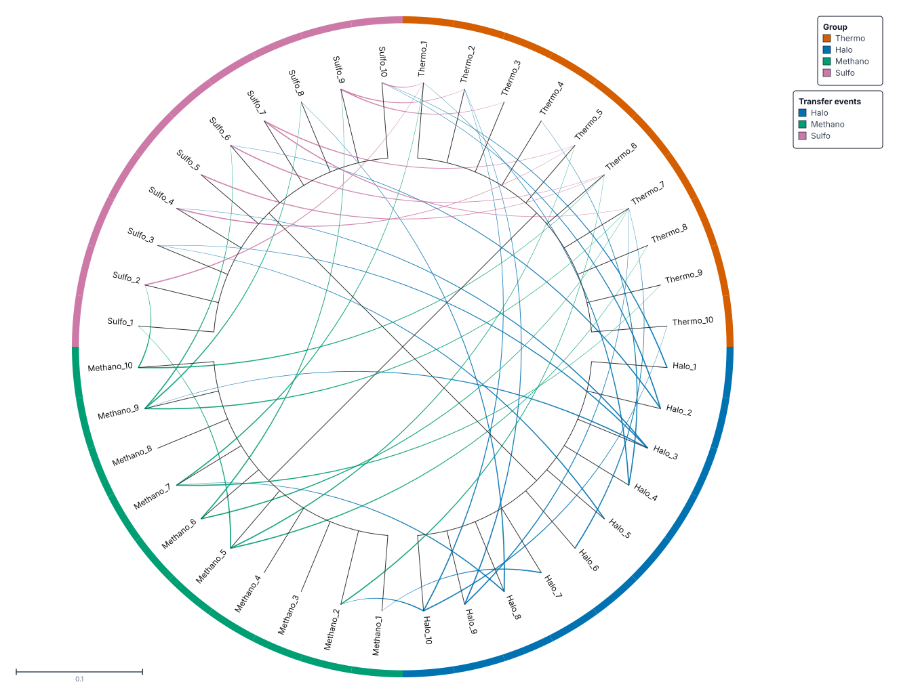
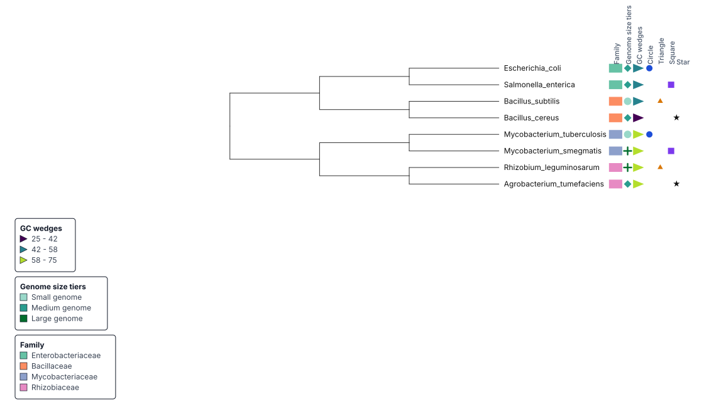
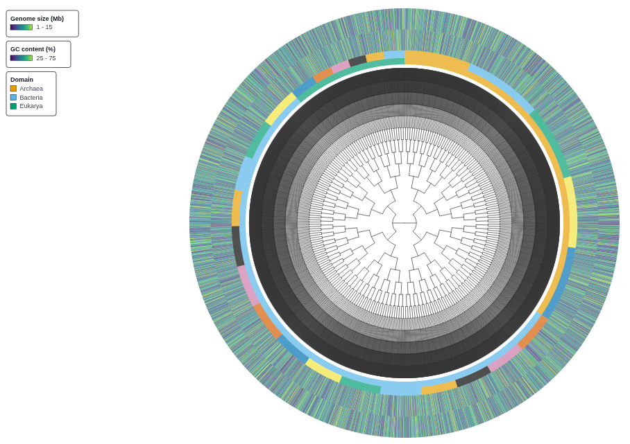
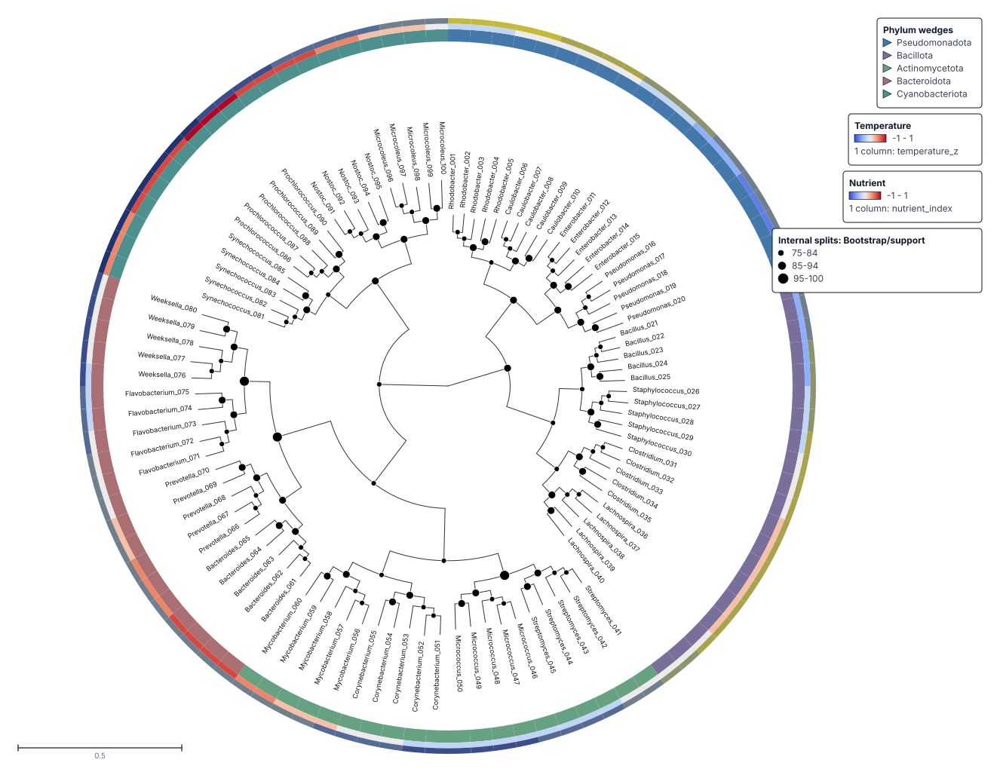
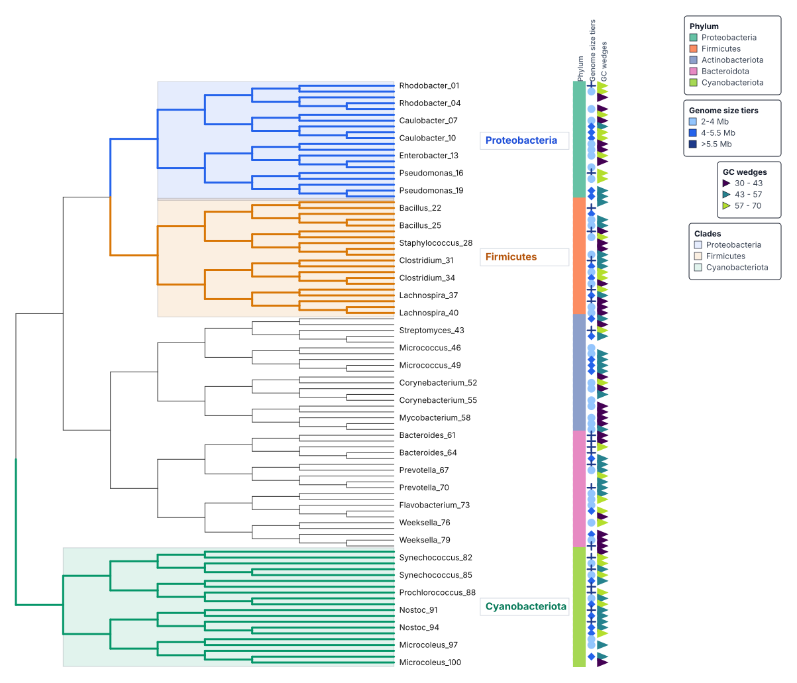
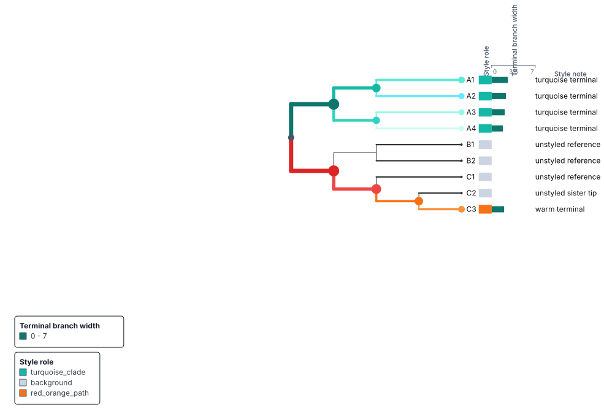

# Examples

Each figure below is a TreeViz export from the linked saved session. Open a
session to inspect the tree, metadata binding, tracks, view settings, and
diagnostics. The source links provide the input tree, metadata table, and TOML
configuration where those files are published.

The TOML files are readable source recipes used to build the saved sessions.
The hosted browser opens the `.treeviz.json` session and exposes the same
settings through its panels and browser API.

The data labels have narrow meanings:

- **Sourced data**: the tree and displayed metadata come from the named source.
- **Synthetic feature demo**: some or all values were generated to demonstrate a rendering feature. Do not interpret them as measurements.
- **Synthetic stress test**: the topology and metadata were generated to test scale and rendering behavior.

The [live manifest](https://treeviz.newlineages.com/examples/manifest.json) is
the machine-readable source for the current catalog, file links, and
provenance.

## Bacterial Diversity Starter

**Sourced data · 42 tips · rectangular phylogram**

[{ loading=lazy }](https://treeviz.newlineages.com/?session=/examples/bacterial-starter/session.treeviz.json)

This starter uses 42 representative species from seven bacterial phyla. The
tree and taxonomy derive from [GTDB release
R232](https://data.gtdb.ecogenomic.org/releases/release232/). A single family strip
shows how a categorical metadata column aligns with leaf labels while leaving
the topology visible.

[Open in TreeViz](https://treeviz.newlineages.com/?session=/examples/bacterial-starter/session.treeviz.json) ·
[SVG figure](assets/gallery/bacterial-starter.svg) ·
[Tree](https://treeviz.newlineages.com/examples/bacterial-starter/tree.nwk) ·
[Metadata](https://treeviz.newlineages.com/examples/bacterial-starter/metadata.tsv) ·
[Configuration](https://treeviz.newlineages.com/examples/bacterial-starter/treeviz.toml)

## Bacterial Encoding Showcase

**Synthetic feature demo · 196 tips · circular tree**

[{ loading=lazy }](https://treeviz.newlineages.com/?session=/examples/bacterial-encoding-showcase/session.treeviz.json)

This figure combines four metadata tracks for 14 family groups, genome-size
symbols, a GC-content gradient, and metabolism categories with node circles and
branch styling. The topology and taxonomy derive from GTDB release R232. Genome
size, GC content, metabolism, branch width, and highlighted-path values are
deterministic synthetic values.

[Open in TreeViz](https://treeviz.newlineages.com/?session=/examples/bacterial-encoding-showcase/session.treeviz.json) ·
[SVG figure](assets/gallery/bacterial-encoding-showcase.svg) ·
[Tree](https://treeviz.newlineages.com/examples/bacterial-encoding-showcase/tree.nwk) ·
[Metadata](https://treeviz.newlineages.com/examples/bacterial-encoding-showcase/metadata.tsv) ·
[Configuration](https://treeviz.newlineages.com/examples/bacterial-encoding-showcase/treeviz.toml) ·
[GTDB source](https://data.gtdb.ecogenomic.org/releases/release232/)

## Synthetic Expression Heatmap (40 genes)

**Synthetic feature demo · 40 genes · rectangular tree**

[{ loading=lazy }](https://treeviz.newlineages.com/?session=/examples/differential-expression/session.treeviz.json)

An illustrative generated gene tree is aligned with a diverging expression
heatmap, a module strip, a response bar, and a composition track. TreeViz does
not calculate the clustering. The topology and every displayed value are
synthetic and demonstrate dense rectangular metadata tracks.

[Open in TreeViz](https://treeviz.newlineages.com/?session=/examples/differential-expression/session.treeviz.json) ·
[SVG figure](assets/gallery/differential-expression.svg) ·
[Tree](https://treeviz.newlineages.com/examples/differential-expression/tree.nwk) ·
[Metadata](https://treeviz.newlineages.com/examples/differential-expression/metadata.tsv) ·
[Configuration](https://treeviz.newlineages.com/examples/differential-expression/treeviz.toml)

## Ancestral State Pies

**Synthetic feature demo · 24 tips · rectangular tree**

[{ loading=lazy }](https://treeviz.newlineages.com/?session=/examples/ancestral-state-pies/session.treeviz.json)

Donut marks show three habitat-state proportions at named internal nodes. A
clade strip identifies the four leaf groups. The topology, leaf metadata, and
ancestral-state values are deterministic fixtures for node-metadata and
node-mark workflows.

[Open in TreeViz](https://treeviz.newlineages.com/?session=/examples/ancestral-state-pies/session.treeviz.json) ·
[SVG figure](assets/gallery/ancestral-state-pies.svg) ·
[Tree](https://treeviz.newlineages.com/examples/ancestral-state-pies/tree.nwk) ·
[Leaf metadata](https://treeviz.newlineages.com/examples/ancestral-state-pies/metadata.tsv) ·
[Node metadata](https://treeviz.newlineages.com/examples/ancestral-state-pies/node-states.tsv) ·
[Configuration](https://treeviz.newlineages.com/examples/ancestral-state-pies/treeviz.toml)

## HGT Connections

**Synthetic feature demo · 40 tips · circular tree**

[{ loading=lazy }](https://treeviz.newlineages.com/?session=/examples/hgt-connections/session.treeviz.json)

Forty synthetic transfer events are drawn as chords between leaves and colored
by donor group. A categorical strip provides the four group labels around the
tree.

[Open in TreeViz](https://treeviz.newlineages.com/?session=/examples/hgt-connections/session.treeviz.json) ·
[SVG figure](assets/gallery/hgt-connections.svg) ·
[Tree](https://treeviz.newlineages.com/examples/hgt-connections/tree.nwk) ·
[Metadata](https://treeviz.newlineages.com/examples/hgt-connections/metadata.tsv) ·
[Transfer table](https://treeviz.newlineages.com/examples/hgt-connections/transfers.tsv) ·
[Configuration](https://treeviz.newlineages.com/examples/hgt-connections/treeviz.toml)

## Genome Symbol Lanes

**Synthetic feature demo · 8 tips · rectangular tree**

[{ loading=lazy }](https://treeviz.newlineages.com/?session=/examples/genome-symbol-lanes/session.treeviz.json)

The tracks compare interval symbols, compact numeric wedges, binary markers,
and a text fallback lane. Familiar bacterial species names label a generated
topology. The displayed track values are also generated.

[Open in TreeViz](https://treeviz.newlineages.com/?session=/examples/genome-symbol-lanes/session.treeviz.json) ·
[SVG figure](assets/gallery/genome-symbol-lanes.svg) ·
[Tree](https://treeviz.newlineages.com/examples/genome-symbol-lanes/tree.nwk) ·
[Metadata](https://treeviz.newlineages.com/examples/genome-symbol-lanes/metadata.tsv) ·
[Configuration](https://treeviz.newlineages.com/examples/genome-symbol-lanes/treeviz.toml)

## Large-Tree Stress Fixture

**Synthetic stress test · 6,000 tips · circular tree**

[{ loading=lazy }](https://treeviz.newlineages.com/?session=/examples/large-bacterial-tree/session.treeviz.json)

This generated dataset tests circular rendering with domain and phylum strips,
genome-size values, and GC-content values. It demonstrates scale and density;
it is not a biological result.

[Open in TreeViz](https://treeviz.newlineages.com/?session=/examples/large-bacterial-tree/session.treeviz.json) ·
[SVG figure (5.7 MB)](assets/gallery/large-bacterial-tree.svg) ·
[Tree](https://treeviz.newlineages.com/examples/large-bacterial-tree/tree.nwk) ·
[Metadata](https://treeviz.newlineages.com/examples/large-bacterial-tree/metadata.tsv) ·
[Configuration](https://treeviz.newlineages.com/examples/large-bacterial-tree/treeviz.toml)

## Bootstrap Support with Taxonomy

**Synthetic feature demo · 100 tips · circular tree**

[{ loading=lazy }](https://treeviz.newlineages.com/?session=/examples/bootstrap-heatmap-taxonomy/session.treeviz.json)

Internal-node marker size encodes bootstrap support. A phylum wedge track and
two continuous heatmap rings show the generated taxonomy and environmental
values.

[Open in TreeViz](https://treeviz.newlineages.com/?session=/examples/bootstrap-heatmap-taxonomy/session.treeviz.json) ·
[SVG figure](assets/gallery/bootstrap-heatmap-taxonomy.svg) ·
[Tree](https://treeviz.newlineages.com/examples/bootstrap-heatmap-taxonomy/tree.nwk) ·
[Metadata](https://treeviz.newlineages.com/examples/bootstrap-heatmap-taxonomy/metadata.tsv) ·
[Configuration](https://treeviz.newlineages.com/examples/bootstrap-heatmap-taxonomy/treeviz.toml)

## Agent Styling Playground

**Synthetic feature demo · 100 tips · rectangular tree**

[{ loading=lazy }](https://treeviz.newlineages.com/?session=/examples/agent-clade-playground/session.treeviz.json)

Named clades, annotation labels, backgrounds, genome-size symbols, and GC
wedges provide a deterministic target for agent-driven styling. Taxon names,
topology, taxonomy, and measurements are generated.

[Open in TreeViz](https://treeviz.newlineages.com/?session=/examples/agent-clade-playground/session.treeviz.json) ·
[SVG figure](assets/gallery/agent-clade-playground.svg) ·
[Tree](https://treeviz.newlineages.com/examples/agent-clade-playground/tree.nwk) ·
[Metadata](https://treeviz.newlineages.com/examples/agent-clade-playground/metadata.tsv) ·
[Configuration](https://treeviz.newlineages.com/examples/agent-clade-playground/treeviz.toml)

## Node and Branch Styling

**Synthetic feature demo · 9 tips · rectangular tree**

[{ loading=lazy }](https://treeviz.newlineages.com/?session=/examples/gradient-node-branch-styling/session.treeviz.json)

Node-circle size and color, branch width and color, and rounded terminal
branches are read from generated metadata. Three metadata tracks show the
style role, terminal-branch width, and a short style note.

[Open in TreeViz](https://treeviz.newlineages.com/?session=/examples/gradient-node-branch-styling/session.treeviz.json) ·
[SVG figure](assets/gallery/gradient-node-branch-styling.svg) ·
[Tree](https://treeviz.newlineages.com/examples/gradient-node-branch-styling/tree.nwk) ·
[Metadata](https://treeviz.newlineages.com/examples/gradient-node-branch-styling/metadata.tsv) ·
[Configuration](https://treeviz.newlineages.com/examples/gradient-node-branch-styling/treeviz.toml)

## Additional Tree-of-Life Figures

These collaboration figures use a 1,070-genome concatenated-marker tree with
84 multi-genome phylum blocks collapsed to wedges. They show wedge geometry,
dual color encodings, labels, and legends on a dense biological tree. The
finished TreeViz sessions are hosted, but the underlying tree and per-phylum
source tables are not published in this repository. Treat these as visual case
studies rather than reproducible example datasets.

### Phyla Collapsed to Wedges

The outline color identifies Bacteria, Archaea, or Eukaryota. Circle area is
proportional to the number of genomes in a phylum block and circle color shows
its isolate category.

[Open in TreeViz](https://treeviz.newlineages.com/?session=/sessions/rekhatree-tol-phyla.treeviz.json)

### Wedge Length by Phylogenetic Diversity

Each wedge's length maps the log10 of the phylum's total phylogenetic diversity
onto a 40 to 400 pixel range.

[Open in TreeViz](https://treeviz.newlineages.com/?session=/sessions/rekhatree-tol-phyla-pd.treeviz.json)

### Domain Outlines and Culturedness Fills

Branch and wedge outlines identify the domain. Wedge fill shows isolate genomes
per unit of phylogenetic diversity.

[Open in TreeViz](https://treeviz.newlineages.com/?session=/sessions/rekhatree-tol-phyla-domain-cultured.treeviz.json)

### Phylum Labels and Isolate Circles

Phylum labels follow the incoming branch and move onto leader lines when they
collide. Circle color encodes isolate-count classes. Three explicit legends
describe domain, isolate count, and culturedness.

[Open in TreeViz](https://treeviz.newlineages.com/?session=/sessions/rekhatree-tol-phyla-labelled.treeviz.json)

The [gallery provenance note](assets/gallery/README.md) records the render and
data source for every committed image, with exact dimensions for the current
catalog exports.
