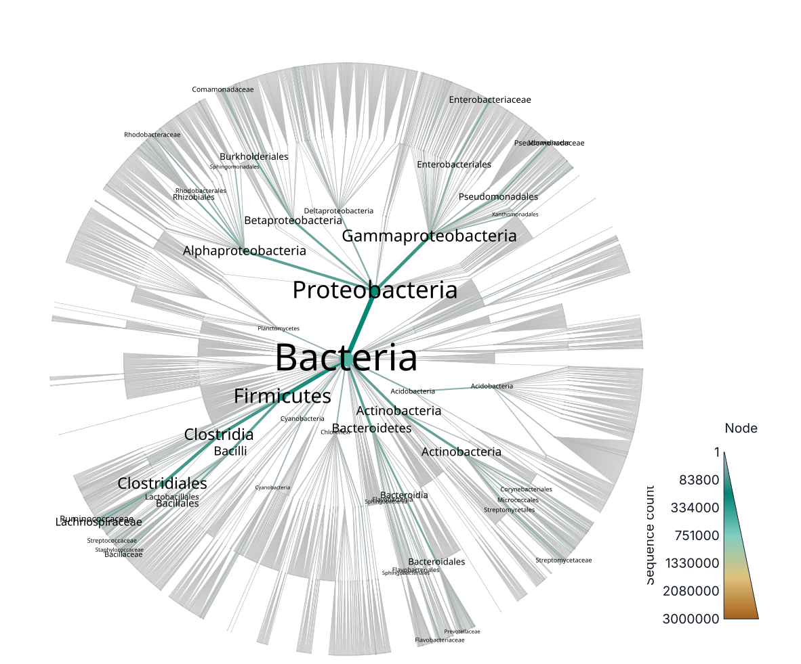
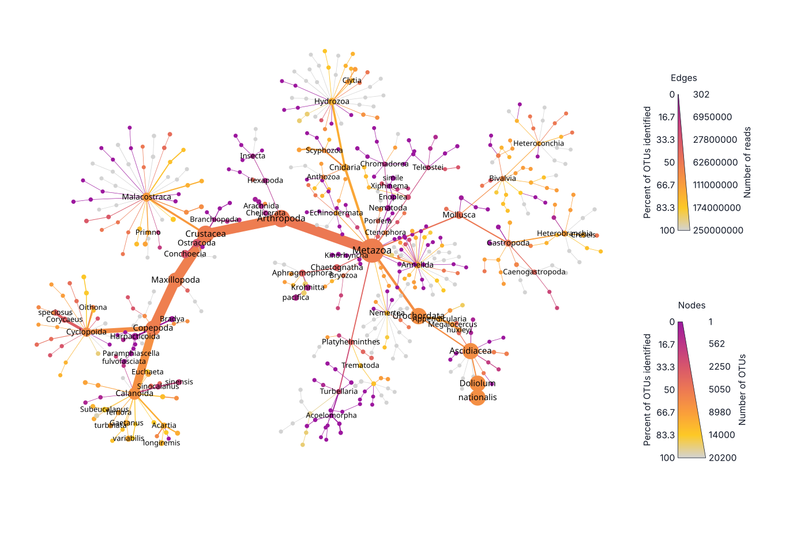
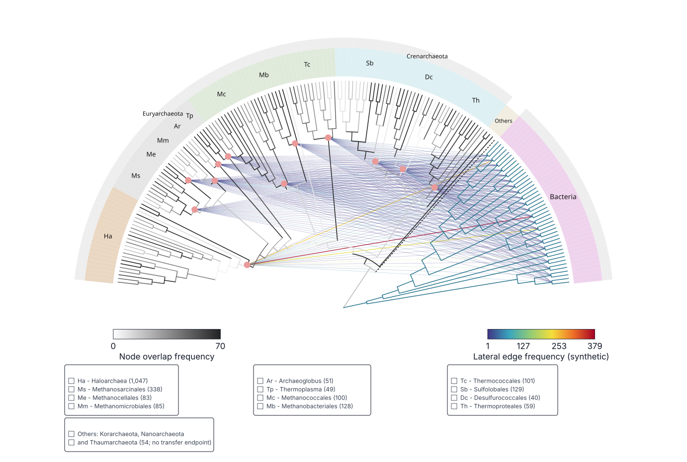
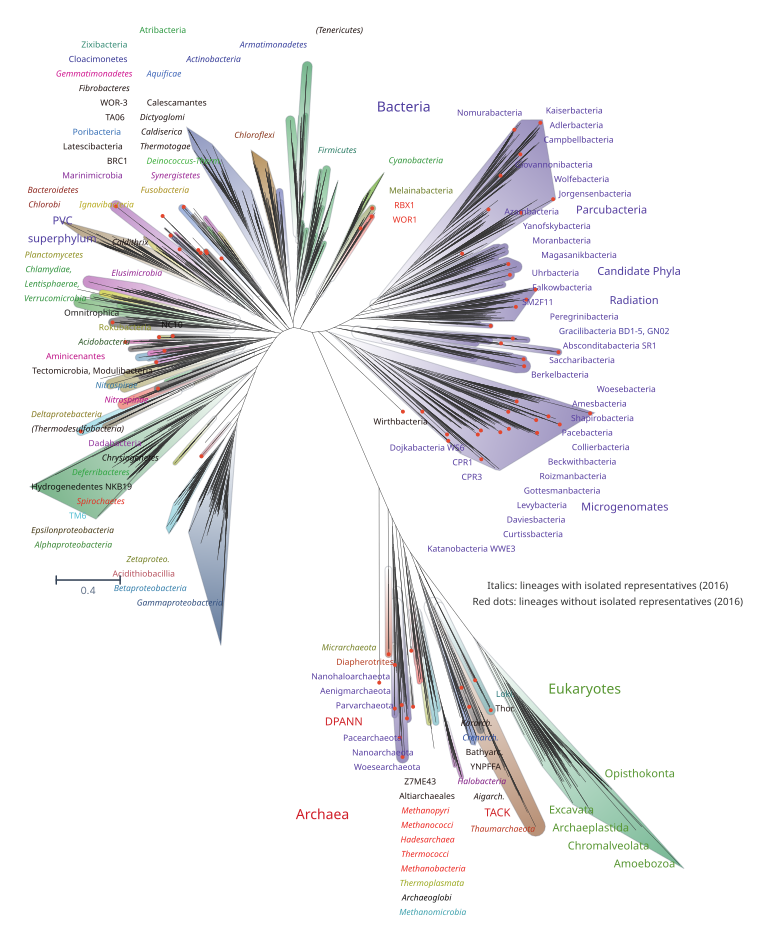

# Examples

The visible catalog contains saved TreeViz sessions. Open one to inspect its
tree, metadata binding, tracks, view, and diagnostics. The [live
manifest](https://treeviz.newlineages.com/examples/manifest.json) is the
machine-readable catalog.

Each card lists the paper title, first author, citation year, figure and DOI.
Expand **Recreate this style** in the landing gallery or Sessions panel for a
reusable prompt with the required metadata formats. **Copy prompt** and
**Download prompt** provide the same text. Give it to an AI assistant with
your tree and metadata files. Restore the example session for the supplied
figure. Use its prompt to apply the style to another data set.

The prompts specify leaf tables, internal-node attributes, optional display
coordinates and synthetic values. A leaf table alone does not supply values
for internal nodes.

## Example 1: Mirusviricota

**Sourced data · 1,204 tips · 18 metadata tracks · circular tree**

[{ loading=lazy }](https://treeviz.newlineages.com/?session=/examples/example-1-mirusviricota/session.treeviz.json)

This is the saved TreeViz view of the Mirusviricota phylogeny from Extended
Data Figure 9 in
[doi:10.1038/s41564-025-02190-6](https://doi.org/10.1038/s41564-025-02190-6).
Its fitted circular opening keeps the metadata track names visible.

[Open in TreeViz](https://treeviz.newlineages.com/?session=/examples/example-1-mirusviricota/session.treeviz.json) ·
[SVG figure](assets/gallery/example-1-mirusviricota.svg) ·
[Source paper](https://doi.org/10.1038/s41564-025-02190-6) ·
[Style prompt and metadata requirements](https://treeviz.newlineages.com/examples/example-1-mirusviricota/recipe.md)

## Example 2: SILVA taxonomy

**Sourced data · 3,843 taxa · 3,257 leaves · 513,121 bacterial 16S sequences · circular taxonomy**

[{ loading=lazy }](https://treeviz.newlineages.com/?session=/examples/example-2-silva/session.treeviz.json)

This saved view reconstructs the upper-left SILVA **Whole database** panel of
Figure 4 from
[Foster et al.](https://doi.org/10.1371/journal.pcbi.1005404), using the SILVA
123.1 taxonomy. Node diameters, branch widths, and colors encode the 513,121
bacterial 16S sequences assigned across the taxonomy. The view labels 50
selected taxa.

Branch depth counts steps through the taxonomy. Circular
angles were reconstructed with the historical igraph 1.0.1 layout algorithm
used by the source workflow. They were not measured from the saved 2017 plot.

[Open in TreeViz](https://treeviz.newlineages.com/?session=/examples/example-2-silva/session.treeviz.json) ·
[SVG figure](assets/gallery/example-2-silva.svg) ·
[Source paper](https://doi.org/10.1371/journal.pcbi.1005404) ·
[Style prompt and metadata requirements](https://treeviz.newlineages.com/examples/example-2-silva/recipe.md)

## Example 3: TARA Oceans Metazoa

**Sourced data · 550 taxa · 275 leaves · 20,212 OTUs · radial taxonomy**

[{ loading=lazy }](https://treeviz.newlineages.com/?session=/examples/example-3-tara-metazoa/session.treeviz.json)

This view reconstructs the upper Metazoa panel of
[Figure 3a](https://doi.org/10.1371/journal.pcbi.1005404.g003) from the
Metacoder paper. Circle sizes encode the 20,212 OTUs and branch widths encode
250,296,231 reads. Colors show the percentage of OTUs with at least
90% identity to their closest reference sequence, following the archived code.
Two legends show independent percentage and count scales.

Taxonomy, statistics, colors and the 73 selected labels come from the published
TARA Oceans W5 data and plotting recipe. Display positions are reconstructed:
named nodes align to the published raster and other nodes use the reconstructed
local geometry. The session retains these positions as editable node metadata.

[Open in TreeViz](https://treeviz.newlineages.com/?session=/examples/example-3-tara-metazoa/session.treeviz.json) ·
[SVG figure](assets/gallery/example-3-tara-metazoa.svg) ·
[Source figure](https://doi.org/10.1371/journal.pcbi.1005404.g003) ·
[Style prompt and metadata requirements](https://treeviz.newlineages.com/examples/example-3-tara-metazoa/recipe.md)

## Example 4: Archaeal gene acquisitions

[{ loading=lazy }](https://treeviz.newlineages.com/?session=/examples/example-4-archaeal-acquisitions/session.treeviz.json)

This example reconstructs Figure 3 from
[Nelson-Sathi et al.](https://doi.org/10.1038/nature13805), on page 4 of the
[paper PDF](https://www.molevol.hhu.de/fileadmin/redaktion/Fakultaeten/Mathematisch-Naturwissenschaftliche_Fakultaet/Biologie/Institute/Molekulare_Evolution/Dokumente/Nelson-Sathi_2015_Nature.pdf#page=4).
The published topology contains 134 archaeal genomes and 44 placeholder tips
representing 22 bacterial groups. Branch greys encode agreement with 70
single-gene trees; terminal colors inherit parent agreement for display.

Twelve acquisition nodes connect to the bacterial groups through 264 straight
lines. The pairwise weights are **synthetic** because the source supplements
do not supply the transfer matrix. The session retains published group counts
separately and records the paper's count discrepancies. Branch lengths and
node angles are reconstructed display geometry. Both color scales have
horizontal legends.

Download the session to restore the full figure. The gallery also provides
generated Newick, leaf metadata, node metadata and the synthetic transfer
table.

[Open in TreeViz](https://treeviz.newlineages.com/?session=/examples/example-4-archaeal-acquisitions/session.treeviz.json) ·
[SVG figure](assets/gallery/example-4-archaeal-acquisitions.svg) ·
[Source paper](https://doi.org/10.1038/nature13805) ·
[Style prompt and metadata requirements](https://treeviz.newlineages.com/examples/example-4-archaeal-acquisitions/recipe.md)

## Example 5: A new view of the tree of life

[{ loading=lazy }](https://treeviz.newlineages.com/?session=/examples/example-5-tree-of-life/session.treeviz.json)

This view reconstructs Figure 1 from [Hug et al. (2016)](https://doi.org/10.1038/nmicrobiol.2016.48).
The published ribosomal-protein tree contains 3,083 tips spanning Bacteria,
Archaea and Eukaryota. The session preserves its topology, terminal names,
and branch lengths; the source Newick has no support values. All 3,083 tips
remain expanded.

An equal-angle phylogram reconstructs the geometry because exact coordinates
cannot be recovered from the flattened PDF vectors. The session renders 135
source concepts as 137 lineage and domain text rows, plus two convention notes,
and uses 167 white-to-color clade backgrounds. Labels retain the paper's 2016
taxonomy, typography and markers. The source legend guides their interpretation;
cultivation status was not checked independently. The gradients reconstruct
source colors and do not encode measurements. The source audit records the label
mappings, including the 614 leaves without a specific-lineage assignment. It
separates published data from reconstructed coordinates and styling.

[Open in TreeViz](https://treeviz.newlineages.com/?session=/examples/example-5-tree-of-life/session.treeviz.json) ·
[SVG figure](assets/gallery/example-5-tree-of-life.svg) ·
[Source paper](https://doi.org/10.1038/nmicrobiol.2016.48) ·
[Style prompt and metadata requirements](https://treeviz.newlineages.com/examples/example-5-tree-of-life/recipe.md)
