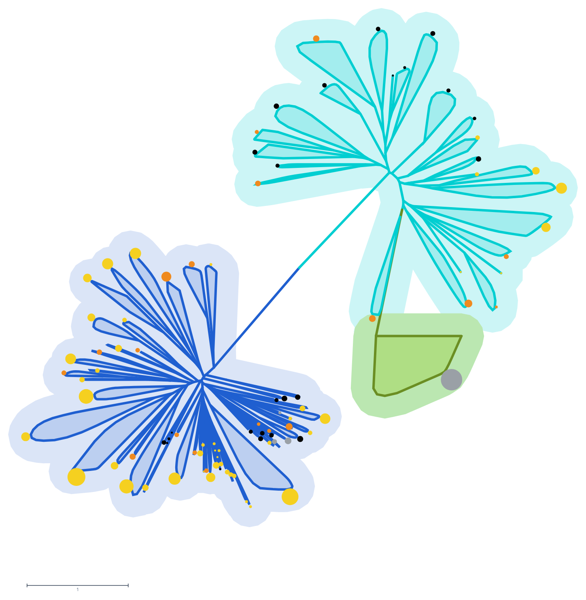
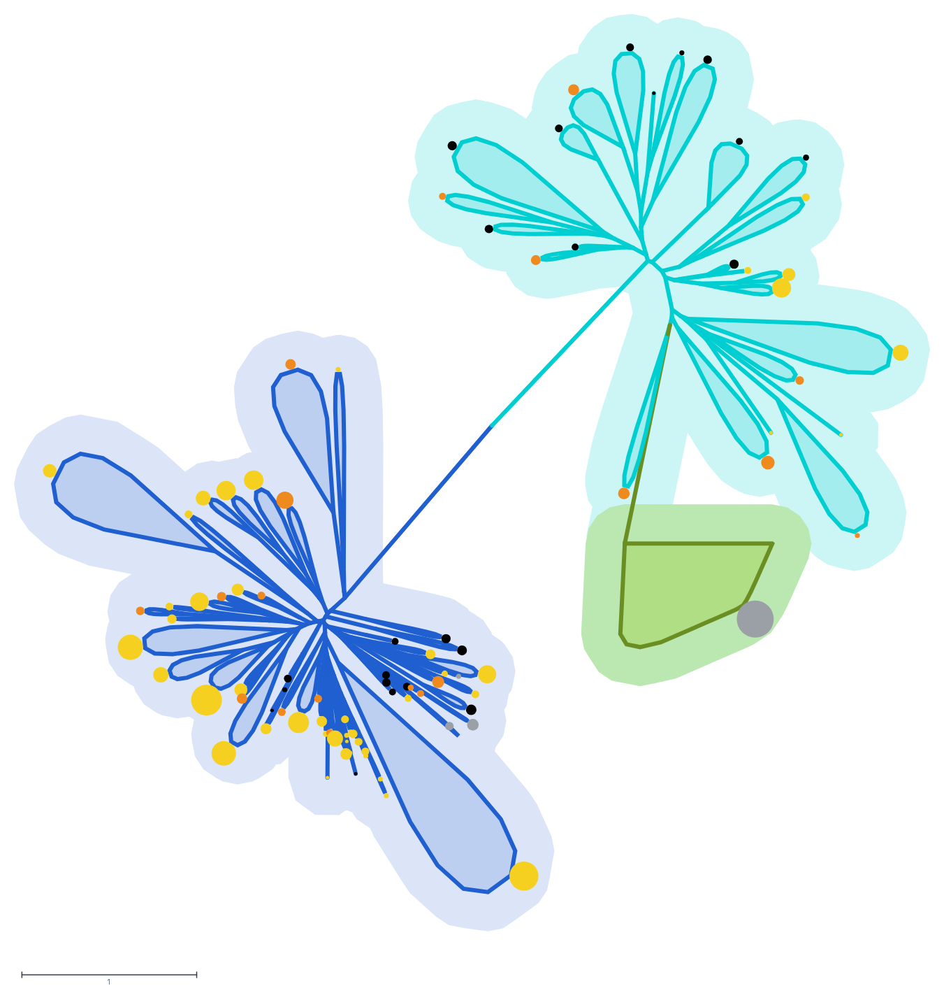
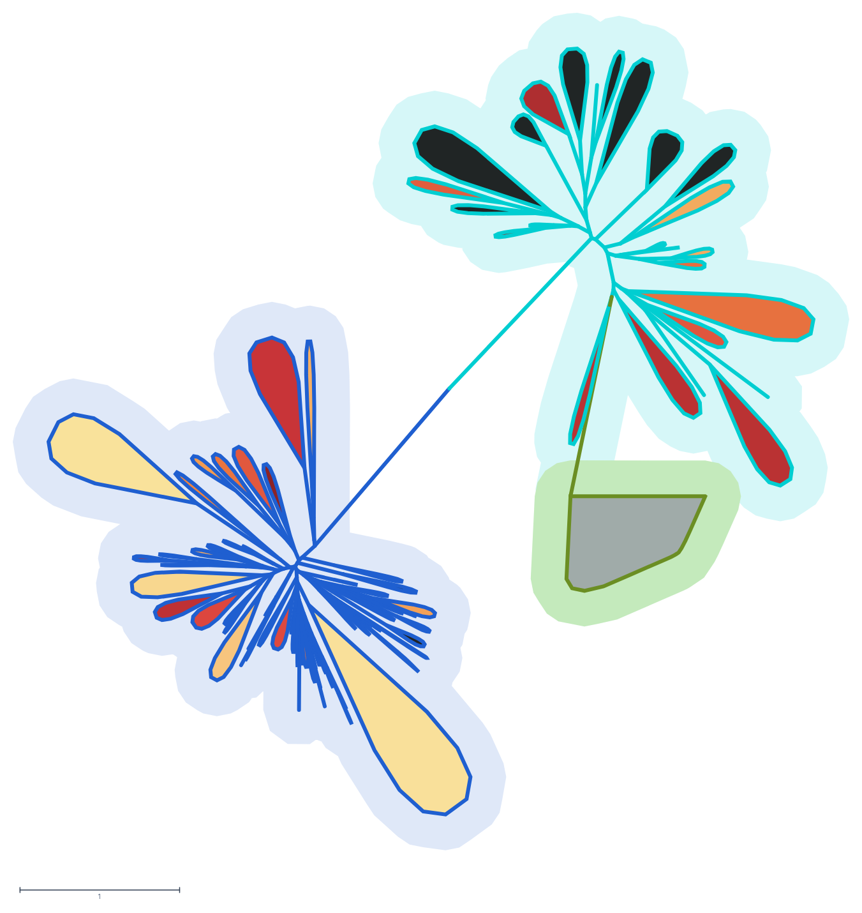
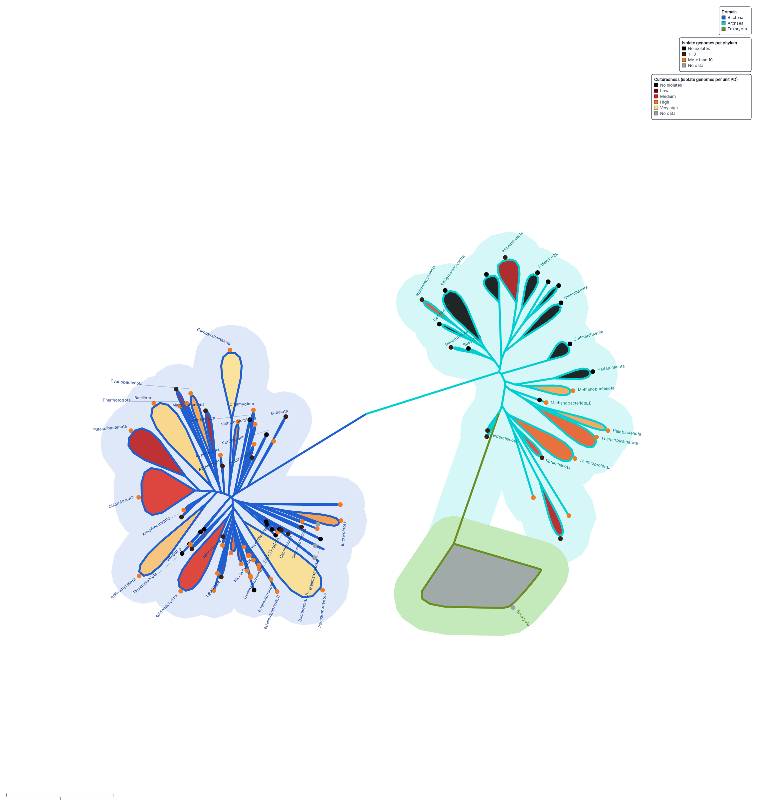
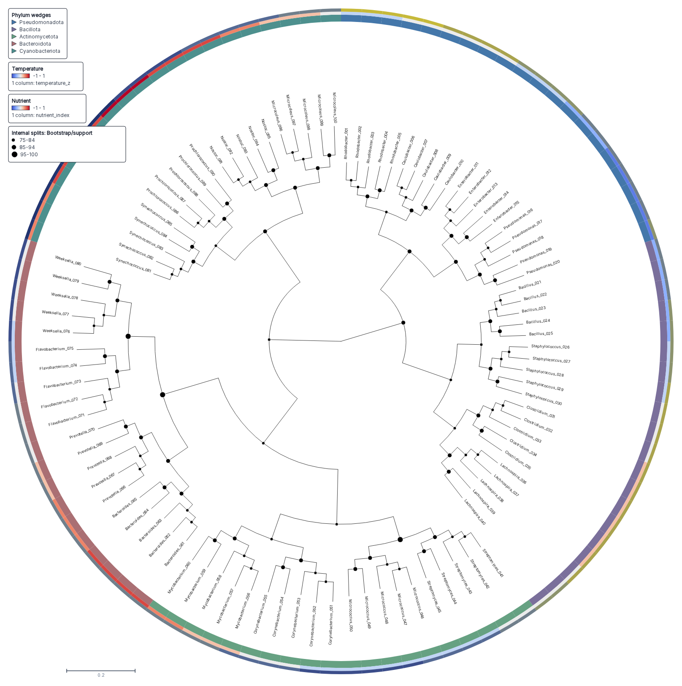
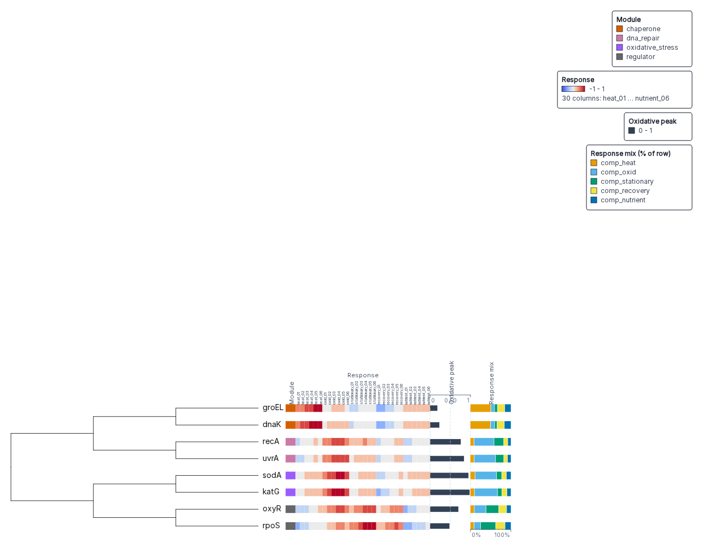

# Examples

Every figure on this page is an export of a session that is hosted on the
live app. Open the session link under a figure to see the saved state, change
a setting in Controls, and export your own version. The settings under each
figure are the `[view]`, `[[branch_rule]]`, `[[legend]]` and
`[attribute_labels]` entries of the TOML config that produces it, or the
`tracks` and `view` arguments of `build_session` in Python.
Each TOML key has a camelCase counterpart on the session view and a short
argument name in `view.set-collapsed-wedge-options`. [Tree
styling](STYLING.md#collapsed-clades) lists the mapping.

## Tree of life, collapsed to phyla

A 1070-genome GTDB concatenated-marker tree (776 Bacteria, 182 Archaea,
112 Eukaryota) in the radial layout. Of its 93 phylum-level blocks, the 84
with more than one genome are collapsed to wedges; the 9 single-genome phyla
stay as leaves. Bacteria are blue, Archaea turquoise, Eukaryota green, and each
domain sits on a fitted underlay that follows its branches and wedges.
Circle area is proportional to the number of genomes in the block, coloured by
isolate category.



[Open the session](https://treeviz.newlineages.com/?session=/sessions/rekhatree-tol-phyla.treeviz.json)

```toml
[view]
layout = "radial"
collapse_attribute = "clps"           # node-meta flag on each phylum root
branch_color_attribute = "vc"         # node-meta colour: domain
branch_width_attribute = "bw"
node_diameter_attribute = "nd"        # node-meta px: 5 * sqrt(genomes)
node_color_attribute = "ncol"
clade_background_outline = "fitted"

[[branch_rule]]
clade = "Bacteria"
clade_background = "rgba(31,95,208,0.16)"

[[branch_rule]]
clade = "Archaea"
clade_background = "rgba(0,206,209,0.20)"

[[branch_rule]]
clade = "Eukaryota"            # listed last: it sits inside Archaea and paints on top
clade_background = "rgba(154,205,50,0.35)"
```

## Wedge length encodes phylogenetic diversity

The same tree. Each wedge's length is log10 of the phylum's total phylogenetic
diversity, mapped onto 40 to 400 px. Length is the target rather than width
because in a radial fan a clade's angular room is bounded by its neighbours. A
data-driven width would be shrunk to avoid overlap. Length keeps each clade's
slot.



[Open the session](https://treeviz.newlineages.com/?session=/sessions/rekhatree-tol-phyla-pd.treeviz.json)

```toml
[view]
collapsed_wedge_size_attribute = "pd"   # node-meta number on each phylum root
collapsed_wedge_size_scale = "log"
collapsed_wedge_size_target = "length"
collapsed_wedge_size_range = [40, 400]
```

## Two colourings on two channels

Branches and wedge outlines carry the domain. Each wedge is filled with a
second colouring: black for phyla with no isolate genomes, and a dark red to
yellow gradient over log10 of isolate genomes per unit of phylogenetic
diversity. The fill opacity is raised from the 0.28 default because the fill
carries data rather than tinting the outline.



[Open the session](https://treeviz.newlineages.com/?session=/sessions/rekhatree-tol-phyla-domain-cultured.treeviz.json)

```toml
[view]
branch_color_attribute = "vc"           # outline colour
collapsed_wedge_fill = "attribute"
collapsed_wedge_fill_attribute = "cc"   # fill colour, a different node-meta key
collapsed_wedge_fill_opacity = 0.85
```

## Labelled phyla with isolate circles

The same figure with phylum names at the wedge tips and a fixed-size circle
per phylum: black for no isolate genomes, dark brown for 1 to 10, orange for
more than 10, grey where no count is available. Each domain colours its own
labels. Labels that share a bearing are pushed outward and joined to their
wedge by a leader line; labels that still collide are culled at the fitted
zoom and return as you zoom in. Three hand-written legends (domain, isolate
genomes per phylum, culturedness) sit in the figure. Any label can be dragged
to a clearer spot. **Show labels** and **Show node circles** in Controls switch
the two layers.



[Open the session](https://treeviz.newlineages.com/?session=/sessions/rekhatree-tol-phyla-labelled.treeviz.json)

```toml
[view]
show_labels = true                # collapsed roots are named after their phylum
show_node_circles = true
node_diameter_attribute = "fd"    # fixed 14 px
node_color_attribute = "fcol"     # isolate category colour
leaf_spacing = 1.6                # more of the turn to the wide clades, so the
                                  # drawing stays compact and the crowded
                                  # bacterial phyla get room
collapsed_wedge_label_declutter = true   # push colliding labels outward, with leader lines
allow_label_overlap = false              # cull labels that still collide; zoom in to see them
figure_legend = true                     # open the in-figure legend on load

[attribute_labels]                # names the Controls pickers show, as "Name (key)"
vc = "Domain colour"
cc = "Culturedness colour"
fcol = "Isolate colour"

[[legend]]
title = "Domain"
entries = [
  { label = "Bacteria", color = "#1f5fd0" },
  { label = "Archaea", color = "#00ced1" },
  { label = "Eukaryota", color = "#6b8e23" }
]

[[legend]]
title = "Isolate genomes per phylum"
entries = [
  { label = "No isolates", color = "#000000" },
  { label = "1-10", color = "#3b1f0e" },
  { label = "More than 10", color = "#f47a1f" },
  { label = "No data", color = "#9aa0a6" }
]
# A third [[legend]] table, "Culturedness (isolate genomes per unit PD)",
# has the same shape.

[[branch_rule]]
clade = "Bacteria"
label_color = "#163e8a"           # inherited by every label in the domain
```

Leaf names have to stay unique, so a phylum represented by a single genome
keeps its accession as the leaf name and gets its phylum label through a rule:

```toml
[[branch_rule]]
label = "GB_GCA_024275655.1"
clade_label = "B1Sed10-29"
```

## Circular taxonomy with heatmap rings

A synthetic 100-tip fixture: bootstrap support as internal-node markers sized
by value, a compact phylum wedge ring, and two trait heatmap rings.



[Open the session](https://treeviz.newlineages.com/?session=/examples/bootstrap-heatmap-taxonomy/session.treeviz.json)

```python
view = {
    "layout": "circular",
    "connectors": "arc",
    "internalNodeMarkerAttribute": "support",
    "internalNodeMarkerEncoding": "size",
}
tracks = [
    {"kind": "color_strip", "column_key": "phylum", "title": "Phylum wedges", "palette": "Tableau10"},
    {"kind": "heatmap", "column_keys": ["temperature_z"], "title": "Temperature", "palette": "coolwarm"},
    {"kind": "heatmap", "column_keys": ["nutrient_index"], "title": "Nutrient", "palette": "Cividis"},
]
```

## Rectangular heatmap with a bar axis

A synthetic 8-tip fixture: a module colour strip, a 30-column heatmap centred
on zero, a quantitative bar track with its axis, and a normalised composition
track.



[Open the session](https://treeviz.newlineages.com/?session=/examples/differential-expression/session.treeviz.json)

```python
conditions = ["heat", "oxid", "stationary", "recovery", "nutrient"]
view = {"layout": "rectangular"}
tracks = [
    {"kind": "color_strip", "column_key": "module", "title": "Module", "palette": "Dark2"},
    {"kind": "heatmap", "title": "Response", "palette": "coolwarm",
     "column_keys": [f"{c}_{i:02d}" for c in conditions for i in range(1, 7)]},
    {"kind": "bar", "column_key": "oxid_04", "title": "Oxidative peak", "show_axis": True},
    {"kind": "stacked_bar", "title": "Response mix", "palette": "okabe-ito",
     "column_keys": [f"comp_{c}" for c in conditions]},
]
```

## More hosted sessions

The live app lists every example under **Sessions**. The manifest at
`https://treeviz.newlineages.com/examples/manifest.json` gives each one's
title, leaf count, and whether its data is synthetic. Two further tree-of-life
variants are hosted: a culturedness gradient on the branches
(`/sessions/rekhatree-tol-phyla-cultured.treeviz.json`) and a muted print
palette (`/sessions/rekhatree-tol-phyla-muted.treeviz.json`).

The [example script](PYTHON.md#runnable-example-script) in the Python package
docs builds sessions like the last two from a table.

How each image on this page was rendered, and where its data comes from, is
recorded in the [gallery provenance notes](assets/gallery/README.md).
