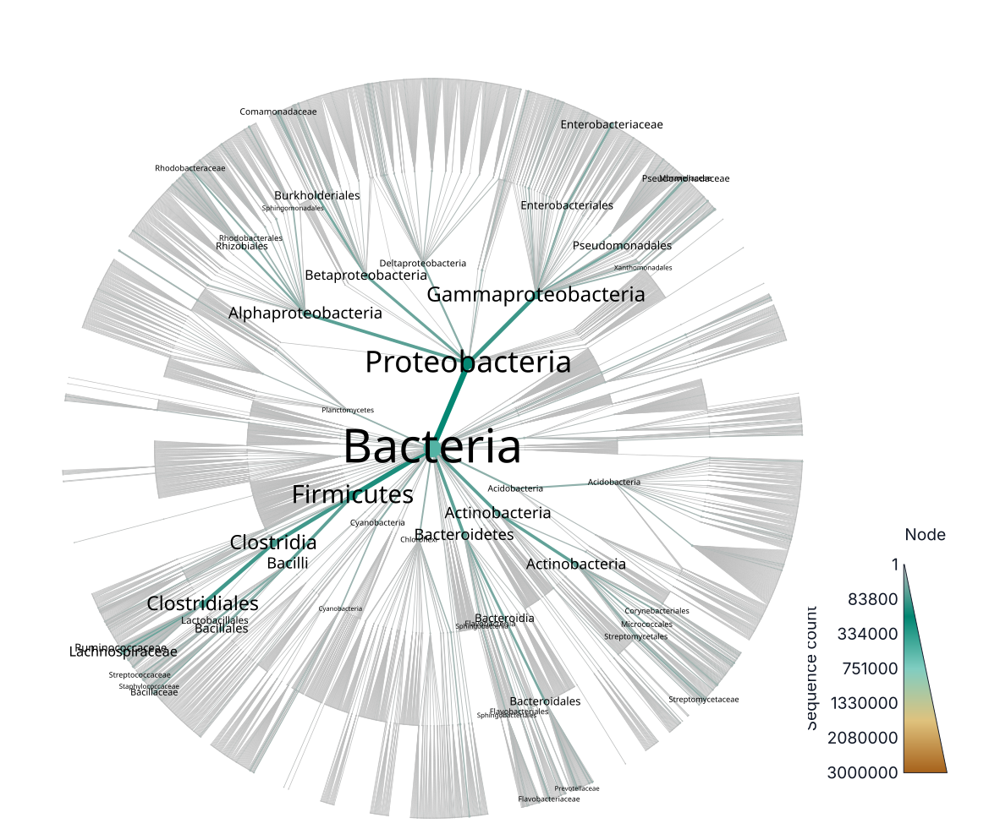
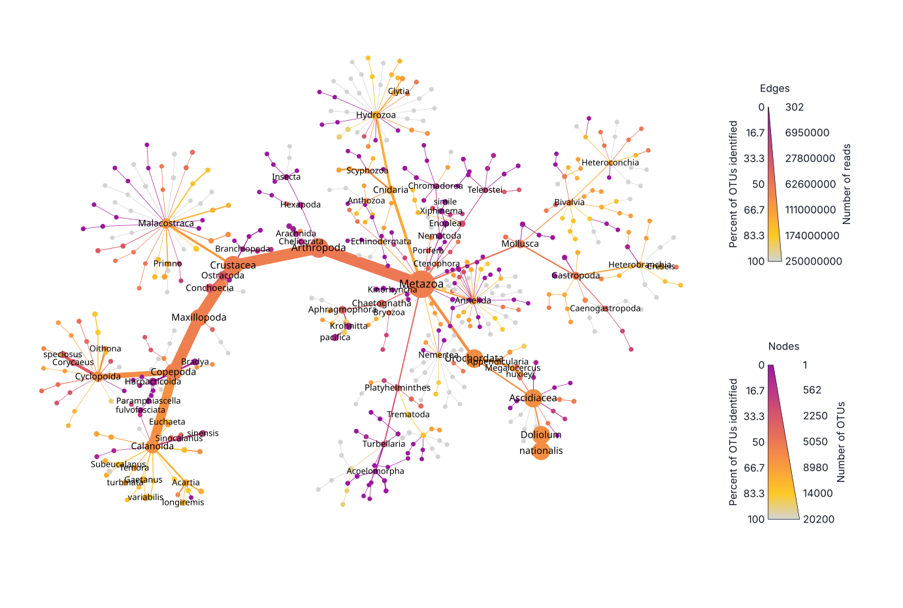
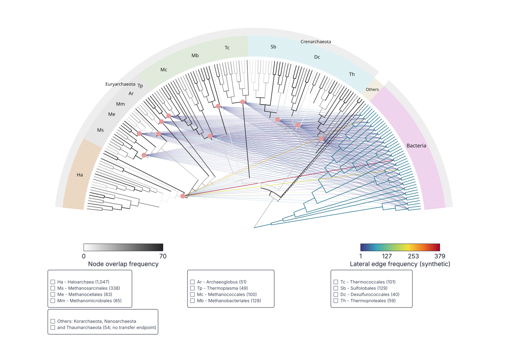
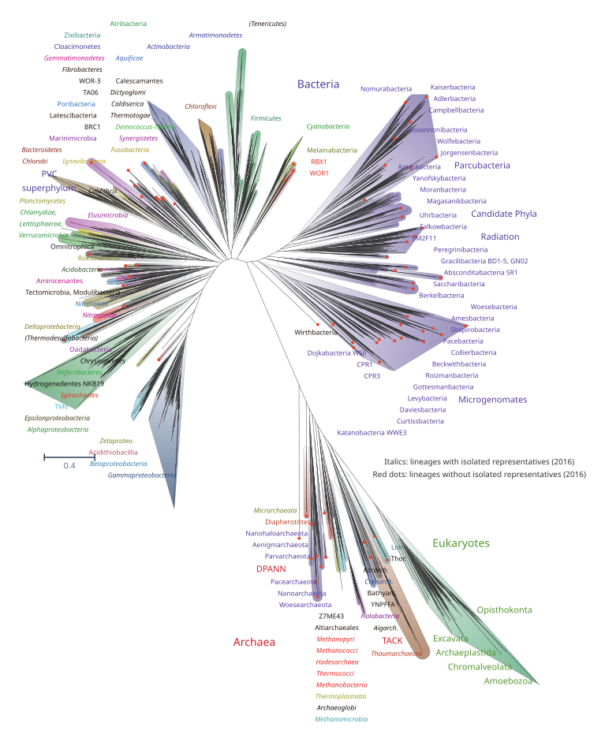

# Examples

The example gallery lists nine saved sessions. Open one to inspect its
tree, metadata binding, tracks, view, and diagnostics. The [live
manifest](https://treeviz.newlineages.com/examples/manifest.json) is the
machine-readable catalog.

Each gallery card lists the paper title, first author, citation year, figure
and DOI. It links **Session**, **Tree**, **Metadata** and, where one exists,
**Config**.
Expand **Recreate this style** in the landing gallery or Sessions panel for a
reusable prompt with the required metadata formats. **Copy prompt** and
**Download prompt** provide the same text. Give it to an AI assistant with
your tree and metadata files. To reproduce the published figure, open its
session. To apply the style to your own data, use the prompt.

Every example below starts with its data, tip count, and layout. After that come
links to the session, the SVG figure, the source paper, the style prompt, and
the hosted files.

The prompts specify leaf tables, internal-node attributes, optional display
coordinates and synthetic values. A leaf table alone does not supply values
for internal nodes.

## Example 1: Mirusviricota

**Sourced data · 1,204 tips · circular tree**

[{ loading=lazy }](https://treeviz.newlineages.com/?session=/examples/example-1-mirusviricota/session.treeviz.json)

Here the Mirusviricota phylogeny from Extended Data Figure 9 in [Medvedeva et
al. (2026)](https://doi.org/10.1038/s41564-025-02190-6) appears as a saved
TreeViz view. The tree carries 18 metadata tracks, and the fitted circular
opening leaves room for their names to stay visible.

[Open in TreeViz](https://treeviz.newlineages.com/?session=/examples/example-1-mirusviricota/session.treeviz.json) ·
[SVG figure](assets/gallery/example-1-mirusviricota.svg) ·
[Medvedeva et al. (2026)](https://doi.org/10.1038/s41564-025-02190-6) ·
[Style prompt and metadata requirements](https://treeviz.newlineages.com/examples/example-1-mirusviricota/recipe.md)

Files: [session.treeviz.json](https://treeviz.newlineages.com/examples/example-1-mirusviricota/session.treeviz.json) · [tree.nwk](https://treeviz.newlineages.com/examples/example-1-mirusviricota/tree.nwk) · [metadata.tsv](https://treeviz.newlineages.com/examples/example-1-mirusviricota/metadata.tsv) · [metadata-audit.json](https://treeviz.newlineages.com/examples/example-1-mirusviricota/metadata-audit.json)

## Example 2: SILVA taxonomy

**Sourced data · 3,257 tips · circular tree**

[{ loading=lazy }](https://treeviz.newlineages.com/?session=/examples/example-2-silva/session.treeviz.json)

Built on the 3,843-taxon SILVA 123.1 taxonomy, this saved view reconstructs the
upper-left SILVA **Whole database** panel of Figure 4 from [Foster et al.
(2017)](https://doi.org/10.1371/journal.pcbi.1005404). Node diameters, branch
widths, and colors together encode the 513,121 bacterial 16S sequences assigned
across the taxonomy. Labels appear on 50 selected taxa.

Branch depth is the number of steps through the taxonomy. The circular angles
come from a reconstruction with the historical igraph 1.0.1 layout algorithm
that the source workflow used, not from measurements of the saved 2017 plot.

[Open in TreeViz](https://treeviz.newlineages.com/?session=/examples/example-2-silva/session.treeviz.json) ·
[SVG figure](assets/gallery/example-2-silva.svg) ·
[Foster et al. (2017)](https://doi.org/10.1371/journal.pcbi.1005404) ·
[Style prompt and metadata requirements](https://treeviz.newlineages.com/examples/example-2-silva/recipe.md)

Files: [session.treeviz.json](https://treeviz.newlineages.com/examples/example-2-silva/session.treeviz.json) · [tree.nwk](https://treeviz.newlineages.com/examples/example-2-silva/tree.nwk) · [metadata.tsv](https://treeviz.newlineages.com/examples/example-2-silva/metadata.tsv) · [data-audit.json](https://treeviz.newlineages.com/examples/example-2-silva/data-audit.json)

## Example 3: TARA Oceans Metazoa

**Sourced data · 275 tips · radial tree**

[{ loading=lazy }](https://treeviz.newlineages.com/?session=/examples/example-3-tara-metazoa/session.treeviz.json)

The upper Metazoa panel of Figure 3a from [Foster et al.
(2017)](https://doi.org/10.1371/journal.pcbi.1005404.g003) is reconstructed here
from a taxonomy of 550 taxa. Circle sizes represent the 20,212 OTUs, and branch
widths represent 250,296,231 reads. Following the archived code, color shows the
percentage of OTUs whose closest reference sequence is at least 90% identical.
Two legends show the independent percentage and count scales.

The published TARA Oceans W5 data and plotting recipe supply the taxonomy,
statistics, colors, and the 73 selected labels. Display positions, on the other
hand, are reconstructed. Named nodes are aligned to the published raster, and
the remaining nodes follow the reconstructed local geometry. The session keeps
these positions as node attributes you can edit.

[Open in TreeViz](https://treeviz.newlineages.com/?session=/examples/example-3-tara-metazoa/session.treeviz.json) ·
[SVG figure](assets/gallery/example-3-tara-metazoa.svg) ·
[Foster et al. (2017)](https://doi.org/10.1371/journal.pcbi.1005404.g003) ·
[Style prompt and metadata requirements](https://treeviz.newlineages.com/examples/example-3-tara-metazoa/recipe.md)

Files: [session.treeviz.json](https://treeviz.newlineages.com/examples/example-3-tara-metazoa/session.treeviz.json) · [tree.nwk](https://treeviz.newlineages.com/examples/example-3-tara-metazoa/tree.nwk) · [metadata.tsv](https://treeviz.newlineages.com/examples/example-3-tara-metazoa/metadata.tsv) · [layout-landmarks.json](https://treeviz.newlineages.com/examples/example-3-tara-metazoa/layout-landmarks.json) · [data-audit.json](https://treeviz.newlineages.com/examples/example-3-tara-metazoa/data-audit.json)

## Example 4: Archaeal gene acquisitions

**Sourced topology, synthetic transfer weights · 178 tips · circular tree**

[{ loading=lazy }](https://treeviz.newlineages.com/?session=/examples/example-4-archaeal-acquisitions/session.treeviz.json)

This example reconstructs Figure 3 of [Nelson-Sathi et al.
(2015)](https://doi.org/10.1038/nature13805), found on page 4 of the [paper
PDF](https://www.molevol.hhu.de/fileadmin/redaktion/Fakultaeten/Mathematisch-Naturwissenschaftliche_Fakultaet/Biologie/Institute/Molekulare_Evolution/Dokumente/Nelson-Sathi_2015_Nature.pdf#page=4).
Its published topology holds 134 archaeal genomes plus 44 placeholder tips that
stand for 22 bacterial groups. Shades of gray on the branches show agreement
with 70 single-gene trees, and for display, terminal branches take their color
from the parent's agreement.

Twelve acquisition nodes link to the bacterial groups through 264 straight
lines. Because the source supplements do not include the transfer matrix, the
pairwise weights are **synthetic**. The session keeps the published group counts
separately and notes where the paper's counts disagree. Branch lengths and node
angles are reconstructed display geometry, and each of the two color scales has
a horizontal legend.

The session restores the full figure. `transfer-metadata.tsv` holds the
synthetic transfer table.

[Open in TreeViz](https://treeviz.newlineages.com/?session=/examples/example-4-archaeal-acquisitions/session.treeviz.json) ·
[SVG figure](assets/gallery/example-4-archaeal-acquisitions.svg) ·
[Nelson-Sathi et al. (2015)](https://doi.org/10.1038/nature13805) ·
[Style prompt and metadata requirements](https://treeviz.newlineages.com/examples/example-4-archaeal-acquisitions/recipe.md)

Files: [session.treeviz.json](https://treeviz.newlineages.com/examples/example-4-archaeal-acquisitions/session.treeviz.json) · [tree.nwk](https://treeviz.newlineages.com/examples/example-4-archaeal-acquisitions/tree.nwk) · [metadata.tsv](https://treeviz.newlineages.com/examples/example-4-archaeal-acquisitions/metadata.tsv) · [node-metadata.tsv](https://treeviz.newlineages.com/examples/example-4-archaeal-acquisitions/node-metadata.tsv) · [transfer-metadata.tsv](https://treeviz.newlineages.com/examples/example-4-archaeal-acquisitions/transfer-metadata.tsv) · [archaeal-groups.tsv](https://treeviz.newlineages.com/examples/example-4-archaeal-acquisitions/archaeal-groups.tsv) · [source-backbone.newick](https://treeviz.newlineages.com/examples/example-4-archaeal-acquisitions/source-backbone.newick) · [layout-landmarks.json](https://treeviz.newlineages.com/examples/example-4-archaeal-acquisitions/layout-landmarks.json) · [data-audit.json](https://treeviz.newlineages.com/examples/example-4-archaeal-acquisitions/data-audit.json)

## Example 5: Tree of life

**Sourced data · 3,083 tips · radial tree**

[{ loading=lazy }](https://treeviz.newlineages.com/?session=/examples/example-5-tree-of-life/session.treeviz.json)

This view reconstructs Figure 1 from [Hug et al. (2016)](https://doi.org/10.1038/nmicrobiol.2016.48).
The published ribosomal-protein tree contains 3,083 tips spanning Bacteria,
Archaea and Eukaryota. The session preserves its topology, terminal names,
and branch lengths; the source Newick has no support values. All 3,083 tips
remain expanded.

An equal-angle phylogram reconstructs the geometry because exact coordinates
cannot be recovered from the flattened PDF vectors. The session renders 135
source concepts as 137 lineage and domain text rows, plus two convention notes,
and uses 167 white-to-color clade backgrounds. Labels retain the paper's 2016
taxonomy, typography and markers. The source legend guides their interpretation;
cultivation status was not checked independently. The gradients reconstruct
source colors and do not encode measurements. The data audit (`data-audit.json`) records the label
mappings, including the 614 leaves without a specific-lineage assignment. It
separates published data from reconstructed coordinates and styling.

[Open in TreeViz](https://treeviz.newlineages.com/?session=/examples/example-5-tree-of-life/session.treeviz.json) ·
[SVG figure](assets/gallery/example-5-tree-of-life.svg) ·
[Hug et al. (2016)](https://doi.org/10.1038/nmicrobiol.2016.48) ·
[Style prompt and metadata requirements](https://treeviz.newlineages.com/examples/example-5-tree-of-life/recipe.md)

Files: [session.treeviz.json](https://treeviz.newlineages.com/examples/example-5-tree-of-life/session.treeviz.json) · [tree.nwk](https://treeviz.newlineages.com/examples/example-5-tree-of-life/tree.nwk) · [metadata.tsv](https://treeviz.newlineages.com/examples/example-5-tree-of-life/metadata.tsv) · [node-metadata.tsv](https://treeviz.newlineages.com/examples/example-5-tree-of-life/node-metadata.tsv) · [source-tree.nwk](https://treeviz.newlineages.com/examples/example-5-tree-of-life/source-tree.nwk) · [data-audit.json](https://treeviz.newlineages.com/examples/example-5-tree-of-life/data-audit.json)

## Example 6: S. aureus CC398

**Sourced metadata, reconstructed tree · 3,128 tips · rectangular tree**

[{ loading=lazy }](https://treeviz.newlineages.com/?session=/examples/example-6-cc398/session.treeviz.json)

This saved view reconstructs Figure 2 from
[Fernandez et al. (2024)](https://doi.org/10.1038/s41467-024-49644-9).
The editable rectangular session contains 3,128 tips with matching metadata
rows. Molecular annotations come from Supplementary Data 1; continent and host
display groups follow the figure's colored cells. The fixture records differences
between the supplement and the plotted annotations.

No original Newick or table of dated branch lengths was found.
The fixture uses an approximate topology and display branch distances recovered
from the vector figure. These distances reproduce the printed geometry; they
are not evolutionary distances or time estimates.

Two tips in the figure carry the label `SAMN39605011`. Figure row 2231 is linked
to Supplementary Data 1 accession `SAMN39605010` because its vector profile is
compatible and, once the other rows are mapped, it is the only workbook
accession left. The profile by itself is not unique, and both the metadata and
the data audit mark this inference. Each of the two tree keys has an explicit
figure-row suffix, so their annotations bind separately.

[Open in TreeViz](https://treeviz.newlineages.com/?session=/examples/example-6-cc398/session.treeviz.json) ·
[SVG figure](https://treeviz.newlineages.com/examples/example-6-cc398/thumbnail.svg) ·
[Fernandez et al. (2024)](https://doi.org/10.1038/s41467-024-49644-9) ·
[Style prompt and metadata requirements](https://treeviz.newlineages.com/examples/example-6-cc398/recipe.md)

Files: [session.treeviz.json](https://treeviz.newlineages.com/examples/example-6-cc398/session.treeviz.json) · [tree.nwk](https://treeviz.newlineages.com/examples/example-6-cc398/tree.nwk) · [metadata.tsv](https://treeviz.newlineages.com/examples/example-6-cc398/metadata.tsv) · [figure-tree.nwk](https://treeviz.newlineages.com/examples/example-6-cc398/figure-tree.nwk) · [data-audit.json](https://treeviz.newlineages.com/examples/example-6-cc398/data-audit.json)

## Example 7: PhyloPhlAn microbial tree of life

**Sourced data · 3,171 tips · circular tree**

[{ loading=lazy }](https://treeviz.newlineages.com/?session=/examples/example-7-phylophlan/session.treeviz.json)

This view adapts Figure 1 from [Segata et al. (2013)](https://doi.org/10.1038/ncomms3304).
It retains the preserved PhyloPhlAn backbone's 3,171 tip names, branch lengths,
support values and unresolved splits. Annotations show taxonomy and marker
completeness. Layout and colors are adapted for TreeViz.

The published figure adds 566 genomes to this backbone. Their placements were
not recovered, so the example contains 3,171 of the figure's 3,737 genomes.
The source tree (`source-tree.nwk`) and its MIT license notice
(`SOURCE-LICENSE.txt`) are hosted with the session.

[Open in TreeViz](https://treeviz.newlineages.com/?session=/examples/example-7-phylophlan/session.treeviz.json) ·
[SVG figure](https://treeviz.newlineages.com/examples/example-7-phylophlan/thumbnail.svg) ·
[Segata et al. (2013)](https://doi.org/10.1038/ncomms3304) ·
[Style prompt and metadata requirements](https://treeviz.newlineages.com/examples/example-7-phylophlan/recipe.md)

Files: [session.treeviz.json](https://treeviz.newlineages.com/examples/example-7-phylophlan/session.treeviz.json) · [tree.nwk](https://treeviz.newlineages.com/examples/example-7-phylophlan/tree.nwk) · [metadata.tsv](https://treeviz.newlineages.com/examples/example-7-phylophlan/metadata.tsv) · [source-tree.nwk](https://treeviz.newlineages.com/examples/example-7-phylophlan/source-tree.nwk) · [SOURCE-LICENSE.txt](https://treeviz.newlineages.com/examples/example-7-phylophlan/SOURCE-LICENSE.txt) · [data-audit.json](https://treeviz.newlineages.com/examples/example-7-phylophlan/data-audit.json)

## Example 8: Bioreactor MAGs

**Sourced metadata, reconstructed tree · 183 tips · circular tree**

[{ loading=lazy }](https://treeviz.newlineages.com/?session=/examples/example-8-reactor-stability/session.treeviz.json)

This view reconstructs Figure 7 from [Mills et al.
(2025)](https://doi.org/10.1038/s41522-025-00679-w). Taxonomy, GC content, and
completeness for the 183 plotted bins come from the supplement, while topology
and branch distances are taken from the vector figure. Those distances describe
the drawing, not evolutionary change.

Neither the matching MAG tree nor the per-sample abundance matrix was supplied.
Heatmap cells keep their published colors as display categories, and no
abundance measurements are inferred from them. The metadata, legends, and data
audit all note this limit.

[Open in TreeViz](https://treeviz.newlineages.com/?session=/examples/example-8-reactor-stability/session.treeviz.json) ·
[SVG figure](https://treeviz.newlineages.com/examples/example-8-reactor-stability/thumbnail.svg) ·
[Mills et al. (2025)](https://doi.org/10.1038/s41522-025-00679-w) ·
[Style prompt and metadata requirements](https://treeviz.newlineages.com/examples/example-8-reactor-stability/recipe.md)

Files: [session.treeviz.json](https://treeviz.newlineages.com/examples/example-8-reactor-stability/session.treeviz.json) · [tree.nwk](https://treeviz.newlineages.com/examples/example-8-reactor-stability/tree.nwk) · [metadata.tsv](https://treeviz.newlineages.com/examples/example-8-reactor-stability/metadata.tsv) · [figure-tree.nwk](https://treeviz.newlineages.com/examples/example-8-reactor-stability/figure-tree.nwk) · [data-audit.json](https://treeviz.newlineages.com/examples/example-8-reactor-stability/data-audit.json)

## Example 9: HMP and MetaHIT gut microbiota

**Sourced profiles, reconstructed layout · 135 tips · circular tree**

[{ loading=lazy }](https://treeviz.newlineages.com/?session=/examples/example-9-metaphlan/session.treeviz.json)

This view adapts Figure 3a from [Segata et al.
(2012)](https://doi.org/10.1038/nmeth.2066), drawing on the archived MetaPhlAn
table of 139 HMP and 85 MetaHIT samples. The table's taxonomic lineages define
the tree. Branch lengths count taxonomy steps, so they are not evolutionary
distances. Abundance and cohort annotations are derived from the source
profiles, and the layout is reconstructed.

The table contains 290 taxa and 135 terminal clades, including 123 species-level rows.
The paper reports 102 species for the combined cohorts; 102 instead matches
HMP alone in the archived table. The example retains all source rows and
records this discrepancy.

The archived profiles (`source-profiles.tsv`) are hosted with the session, so
the cohort calculations can be checked.

[Open in TreeViz](https://treeviz.newlineages.com/?session=/examples/example-9-metaphlan/session.treeviz.json) ·
[SVG figure](https://treeviz.newlineages.com/examples/example-9-metaphlan/thumbnail.svg) ·
[Segata et al. (2012)](https://doi.org/10.1038/nmeth.2066) ·
[Style prompt and metadata requirements](https://treeviz.newlineages.com/examples/example-9-metaphlan/recipe.md)

Files: [session.treeviz.json](https://treeviz.newlineages.com/examples/example-9-metaphlan/session.treeviz.json) · [tree.nwk](https://treeviz.newlineages.com/examples/example-9-metaphlan/tree.nwk) · [metadata.tsv](https://treeviz.newlineages.com/examples/example-9-metaphlan/metadata.tsv) · [node-metadata.tsv](https://treeviz.newlineages.com/examples/example-9-metaphlan/node-metadata.tsv) · [source-profiles.tsv](https://treeviz.newlineages.com/examples/example-9-metaphlan/source-profiles.tsv) · [reconstructed-taxonomy.nwk](https://treeviz.newlineages.com/examples/example-9-metaphlan/reconstructed-taxonomy.nwk) · [data-audit.json](https://treeviz.newlineages.com/examples/example-9-metaphlan/data-audit.json)
