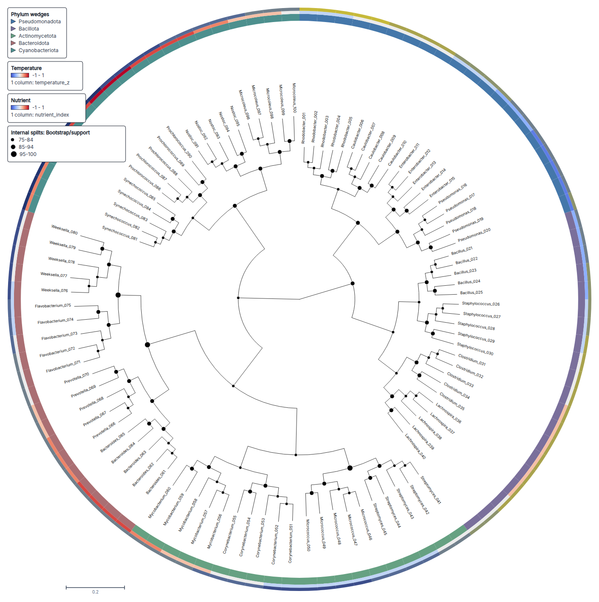
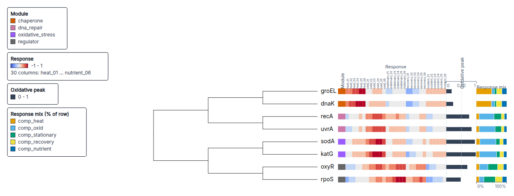
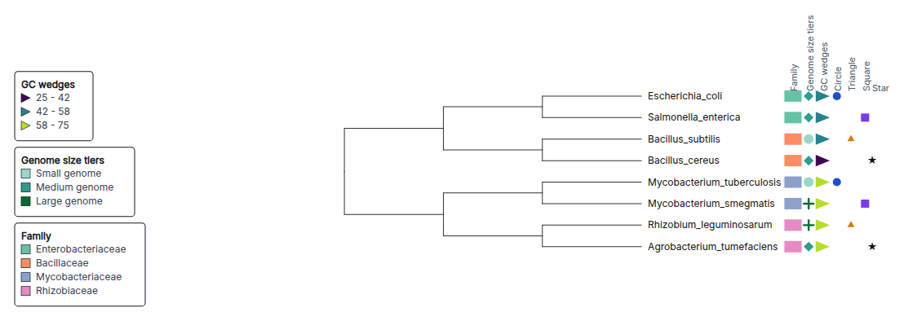
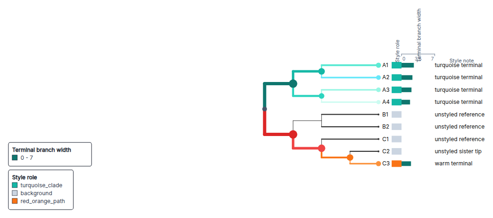
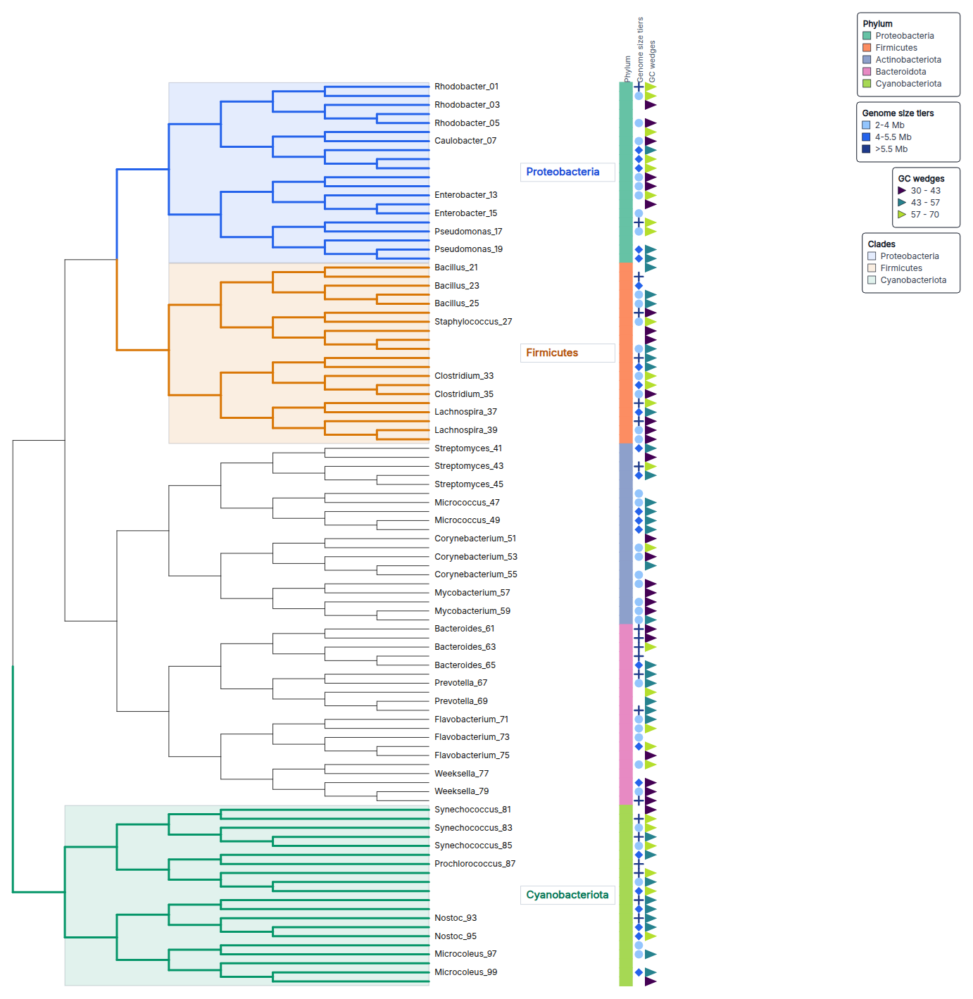
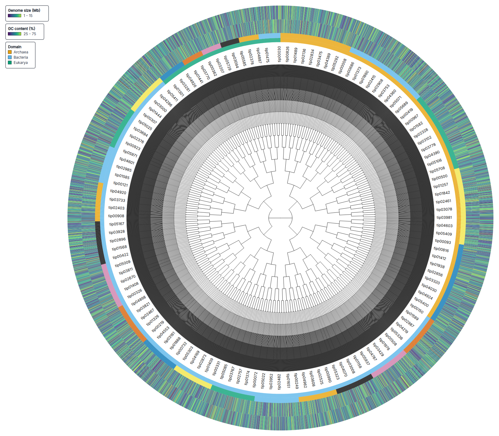

# Styling

TreeViz styling is data-first. The hosted browser, `.treeviz.json` sessions,
and `window.__treeviz` use the same palette ids and style fields. The current
hosted browser has fields that are not yet in `treeviz-phylo` 0.1.0.

## Palette Registry

The web app ships a small static palette registry. Inspect it from the browser
API:

```js
window.__treeviz.palettes()
```

Each palette record contains:

- `id`: stable palette id accepted by sessions and browser commands.
- `label`: display label for UI controls.
- `role`: `categorical`, `sequential`, `diverging`, or `neutral`.
- `colors`: deterministic hex stops.
- `recommendedUse`: when to use the palette.
- `warnings`: limits such as category count or contrast caveats.
- `colorblindFriendly`: whether the palette is appropriate for common CVD use.
- `source`: source or inspiration note.

Current palette ids:

| Role          | IDs                                                                                 | Typical use                                                                        |
| ------------- | ----------------------------------------------------------------------------------- | ---------------------------------------------------------------------------------- |
| `categorical` | `okabe-ito`, `Set2`, `Tableau10`, `Dark2`, `Paired`, `Muted`, `ncldv-order-special` | unordered groups such as clade class, phenotype, environment, host, or domain      |
| `sequential`  | `Viridis`, `Magma`, `Cividis`, `Blues`                                              | ordered positive values such as abundance, support, load, or intensity             |
| `diverging`   | `RdBu`, `blue-orange`, `RdYlBu`, `PurpleGreen`, `BrBG`, `coolwarm`                  | centered signed values such as effects, residuals, contrasts, or score differences |
| `neutral`     | `gray`, `slate`, `soft-mono`                                                        | context, hidden branches, secondary tracks, and de-emphasized labels               |

Legacy spellings such as `viridis`, `tableau10`, `category10`, and
`diverging-rdbu` are accepted as aliases. New examples should use the ids in
the table.

## Track Palettes

Browser API:

```js
await window.__treeviz.execute('track.update', {
  trackId: 'track-effect',
  patch: { palette: 'blue-orange', domain: [-3, 3] }
})
```

Python:

```python
tracks = [
    {"kind": "color_strip", "column_key": "phylum", "palette": "okabe-ito"},
    {"kind": "heatmap", "column_keys": ["log_fc", "effect"], "palette": "blue-orange"},
]
```

For exact category colors, use `categoryColors` in a session or command patch.
Exact colors are preserved in saved sessions and legends.

## Compact Track Symbols And Wedges

Categorical `color-strip` tracks can keep their default strip display or render
each category as compact symbols or wedges:

```js
await window.__treeviz.execute('track.update', {
  trackId: 'track-host',
  patch: { displayMode: 'wedge', width: 16 }
})

await window.__treeviz.execute('track.update', {
  trackId: 'track-quality',
  patch: { displayMode: 'symbol', symbolShape: 'diamond', width: 18 }
})
```

Numeric `bar` tracks can be converted into interval symbols or wedges. Manual
bins are evaluated in order; `minInclusive` defaults to true and
`maxInclusive` defaults to false unless set explicitly. `autoBins` creates
equal-width bins across the track domain.

```js
await window.__treeviz.execute('track.update', {
  trackId: 'track-support',
  patch: {
    displayMode: 'symbol',
    symbolShape: 'circle',
    width: 18,
    bins: [
      { label: 'Low support', max: 60, color: '#d7191c', shape: 'dash' },
      {
        label: 'High support',
        min: 90,
        max: 100,
        maxInclusive: true,
        color: '#1a9641',
        shape: 'plus'
      }
    ]
  }
})

await window.__treeviz.execute('track.update', {
  trackId: 'track-abundance',
  patch: {
    displayMode: 'wedge',
    autoBins: 3,
    palette: 'Viridis',
    width: 18
  }
})
```

Read the track ids from `getSession().tracks`. Supported symbols are `circle`,
`square`, `triangle`, `diamond`, `plus`, and `dash`; legends preserve category
labels and interval labels for symbols and wedges.

## Exact Node And Branch Styling

Map data attributes to node circles and branch strokes through the browser API:

```js
await window.__treeviz.execute('view.set-tree-style-attributes', {
  nodeDiameterAttribute: 'node_diameter',
  nodeColorAttribute: 'node_color',
  branchWidthAttribute: 'branch_width',
  branchColorAttribute: 'branch_color'
})

await window.__treeviz.execute('view.set-pretty-terminal-branches', {
  enabled: true
})
```

Diameter and branch-width values are pixels. Internal nodes read tree metadata
such as Newick/Nexus annotations; terminal leaves read tree metadata first and
then the bound metadata row. `view.set-tree-style-attributes` sets the four
attribute mappings. Pretty terminal branches are a separate view command.

## Conditional Style Rules

Use conditional style rules when metadata values need thresholds, bins, or
category logic instead of exact visual values. Rules are ordered; later rules
win for the same node or branch target.

```js
await window.__treeviz.execute('view.set-conditional-style-rules', {
  rules: [
    {
      id: 'high-abundance-branch',
      source: 'abundance',
      condition: { kind: 'interval', min: 10 },
      target: 'branch-width',
      value: 4
    },
    {
      id: 'soil-labels',
      source: 'host',
      condition: { kind: 'exact', value: 'soil' },
      target: 'label-color',
      value: '#1d4ed8'
    },
    {
      id: 'top-abundance-symbol',
      source: 'abundance',
      condition: { kind: 'rank', top: 1 },
      target: 'symbol',
      value: {
        shape: 'diamond',
        color: '#7b3294',
        size: 9,
        label: 'Top abundance'
      }
    }
  ]
})
```

Supported conditions:

- `exact`: match a string, number, boolean, or missing value.
- `interval`: numeric range with optional `minInclusive` and `maxInclusive`.
- `quantile`: numeric quantile fraction range from 0 to 1.
- `rank`: top or bottom numeric ranks.
- `missing`: missing, null, undefined, or blank string.
- `boolean`: boolean values; string forms such as `true`, `false`, `yes`, and
  `no` are accepted.
- `contains`: text contains; case-insensitive by default.
- `regex`: JavaScript regular expression pattern and optional flags.

Rendered targets are `branch-color`, `branch-width`, `node-color`, `node-size`,
`internal-marker-color`, `internal-marker-size`, `label-color`,
`label-weight`, and `label-visibility`. `symbol`, `wedge`, and
`track-bar-color` are saved in sessions and resolved for compact track
workflows; compact track display itself is controlled by `displayMode` on the
track.

## Prompt-To-Figure Recipes

TreeViz does not run a language model in the browser. The expected agent
workflow is: translate a natural-language request into browser commands or
package code; validate the session; render a tight export; then inspect
diagnostics and layout metrics.

### Circular Taxonomy Wedges

Prompt:

> Create a circular tree using a colorblind-safe categorical palette for
> taxonomy, show compact wedge tracks and a diverging trait heatmap, and export
> a tight PNG.

Open the
[hosted bootstrap and taxonomy session](https://treeviz.newlineages.com/?session=%2Fexamples%2Fbootstrap-heatmap-taxonomy%2Fsession.treeviz.json&api=1),
inspect diagnostics and layout metrics, then export PNG or SVG from the app.

Visual intent: circular 100-tip taxonomy tree, bootstrap markers, one compact
phylum wedge ring, and two signed trait heatmap rings.



### Diverging Heatmap And Bar Axis

Prompt:

> Use a blue-red diverging palette centered at zero for signed response scores,
> include a module strip, retain the oxidative-response bar axis, and export a
> compact rectangular figure.

Open the
[hosted differential-expression session](https://treeviz.newlineages.com/?session=%2Fexamples%2Fdifferential-expression%2Fsession.treeviz.json&api=1),
inspect diagnostics and layout metrics, then export PNG or SVG from the app.

Visual intent: a small rectangular tree with a module strip, a dense 30-column
heatmap centered on zero, a quantitative bar axis, and a normalized composition
track.



### Compact Symbol And Wedge Lanes

Prompt:

> Convert genome size into three symbol bins, render GC content as compact
> wedges, keep the binary marker lanes, and minimize whitespace.

Open the
[hosted genome-symbol session](https://treeviz.newlineages.com/?session=%2Fexamples%2Fgenome-symbol-lanes%2Fsession.treeviz.json&api=1),
inspect diagnostics and layout metrics, then export PNG or SVG from the app.

Visual intent: a compact rectangular example that shows manual bar interval
symbols, automatic bar wedges, categorical strips, binary marker lanes, and a
text fallback lane in one reproducible session.



### Node And Branch Styling

Prompt:

> Use metadata-defined node circles and branch strokes, draw a turquoise
> ancestor-to-tip gradient plus one warm root-to-tip path, and export a
> manuscript-ready figure.

Open the
[hosted node and branch styling session](https://treeviz.newlineages.com/?session=%2Fexamples%2Fgradient-node-branch-styling%2Fsession.treeviz.json&api=1),
inspect diagnostics and layout metrics, then export PNG or SVG from the app.

Visual intent: exact data-defined node sizes, node colors, branch widths, and
branch colors, with metadata tracks explaining terminal roles.



## Screenshot Gallery

These screenshots come from the current hosted example sessions. Open the
linked session to inspect the saved state, diagnostics, layout metrics, and
export controls.

| Screenshot | Reproducibility note |
| ---------- | -------------------- |
|  | [Open session](https://treeviz.newlineages.com/?session=%2Fexamples%2Fdifferential-expression%2Fsession.treeviz.json&api=1). Compact heatmap with a bar axis and composition track. |
|  | [Open session](https://treeviz.newlineages.com/?session=%2Fexamples%2Fgenome-symbol-lanes%2Fsession.treeviz.json&api=1). Explicit symbol bins and automatic wedge bins. |
|  | [Open session](https://treeviz.newlineages.com/?session=%2Fexamples%2Fagent-clade-playground%2Fsession.treeviz.json&api=1). Clade labels, underlays, symbols, and wedges on a 100-tip tree. |
|  | [Open session](https://treeviz.newlineages.com/?session=%2Fexamples%2Fbootstrap-heatmap-taxonomy%2Fsession.treeviz.json&api=1). Circular labels, support marks, wedges, and heatmap rings. |
|  | [Open session](https://treeviz.newlineages.com/?session=%2Fexamples%2Fgradient-node-branch-styling%2Fsession.treeviz.json&api=1). Exact node and branch styling with role tracks. |
|  | [Open session](https://treeviz.newlineages.com/?session=%2Fexamples%2Flarge-bacterial-tree%2Fsession.treeviz.json&api=1). A 6,000-tip stress view with categorical and quantitative rings. |
