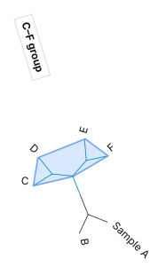
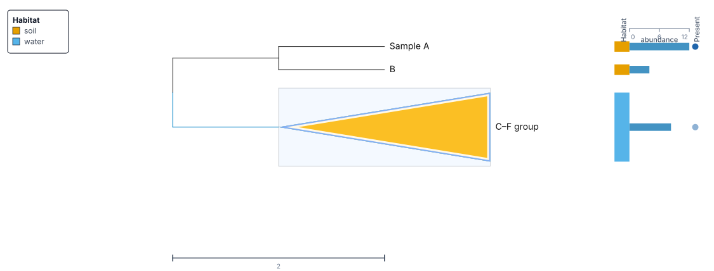

# Highlight, label, and collapse clades

Mark related leaves with a name, branch color, or shaded background. Collapse
their clade into a wedge when you want to show less detail.

Open your tree or download [the six-leaf example](../tutorials/data/first-tree.nwk).
The examples below use the clade containing **C, D, E, and F**. A clade consists
of one ancestor and all its descendants.

| To show                                                       | Use                                  |
| ------------------------------------------------------------- | ------------------------------------ |
| Colored branches for a group                                 | **Style clade** → **Branch color**   |
| A name for the group                                          | **Annotate clade…**                  |
| A shaded area behind a group, with its branches still visible | **Style clade** → **Clade underlay** |
| A compact shape in place of the group's descendants           | **Collapse clade**                   |

A **wedge** represents a collapsed clade. A **hull** is the outline of a clade's
background in the **Radial** layout. Adding a hull does not collapse the clade.

## Select the clade

1. Click **Rect** above the tree to use the rectangular layout.
2. Find the branch junction that joins the C–D pair to the E–F pair.
3. Double-click that junction to select its internal node and open the
   **Inspector**.
4. Check that **Descendant leaves** is **4** and **Descendant terminal leaves**
   lists **C, D, E, F**.

Check the descendant list before styling a clade on a larger tree. An internal
node identifies its whole clade; a leaf's node identifies only that leaf.

If the junction is hard to find, select its ancestor from two leaves:

1. Click **C**, then hold **Ctrl** on Windows or Linux, or **Cmd** on macOS, and
   click **E** to keep both selected.
2. Right-click one of those selected leaves and choose **Find MRCA of selection**.
   MRCA means _most recent common ancestor_.
3. Double-click the selected ancestor to inspect it. It includes **D** and **F**
   as well as the two leaves you selected.

To select every visible leaf within a clade, right-click its internal node and
choose **Select descendants**. Hold **Ctrl** or **Cmd** while clicking individual
leaves to add or remove them from a selection.

## Add a clade label

1. Right-click the internal node for **C, D, E, F**.
2. Choose **Annotate clade…**, type `C–F group`, and press **Enter**. Clicking
   elsewhere cancels the text edit.
3. Right-click the same node and choose **Style clade**.
4. Under **Clade annotation**, choose the text color, use **B** for bold text,
   or adjust the size slider.
5. Click **Done**.

Drag the annotation text to move it. Double-click it to edit its wording, or
right-click it and choose **Rename annotation…**. Press **Enter** to save the edit.

**Clade annotation** formats the group name. **Label color** and **Label style**
in the same style panel format the descendant leaf labels. Changing a clade
annotation does not rename the leaves or alter their metadata matches.

## Color the branches and leaf labels

1. Right-click the clade's internal node and choose **Style clade**.
2. Under **Branch color**, choose a color from the palette or enter a color
   such as `#0284c7` in the color field.
3. Adjust **Line width**, or choose a **Line style** such as **Dashed**.
4. Under **Label color**, choose a color for the descendant leaf labels.
   Under **Label style**, use **B**, **I**, or the size slider.
5. Click **Done** to close the panel and keep any color typed into a field.

The branch color applies throughout the clade and takes precedence over colors
derived from its metadata.

To change one leaf instead, double-click its label or node and use the
**Inspector** controls for **Branch color**, **Label color**, and **Label size**.
To rename a leaf, right-click it, choose **Rename leaf**, type its new name, and
press **Enter**. TreeViz keeps the original identifier for metadata matching, so
the rename changes the displayed name while preserving its metadata in the
session.

## Add a background or hull

1. Keep the **C, D, E, F** clade expanded.
2. Right-click its internal node and choose **Style clade**.
3. Under **Clade underlay**, choose a color, then click **Done**. A translucent
   background appears behind the clade's branches.
4. Click **Radial** above the tree.
5. Open **Controls**, expand **Branches & nodes**, and scroll to
   **Collapsed wedges**.
6. Set **Background** to **Hull** to surround the clade with one outline.
   Choose **Fitted** for a background that follows its branches and wedges more
   closely.

The **Background** selector changes the shape of all radial clade backgrounds.
Give each clade its own color with **Clade underlay**. These controls work even
when no clades are collapsed.

In **Rect**, the underlay is a band behind the clade. In **Circular**, it is a
sector. **Hull** and **Fitted** apply to **Radial**.

{ width="320" }

The hull surrounds C, D, E, and F while keeping their branches visible. Tracks
and the legend are hidden here to show the branches.

## Collapse a clade into a wedge

1. Right-click the **C, D, E, F** internal node and choose **Collapse clade**.
   **Collapse** in its **Inspector** does the same.
2. Check that a wedge replaces those four leaves and their branches. If you
   added the `C–F group` annotation, the wedge uses that name.
3. Right-click the wedge and choose **Style clade**.
4. Set **Branch and wedge outline color** for its outline and **Wedge fill** for
   its interior. Click **Done**.
5. To restore the leaves, right-click the wedge and choose **Expand clade**, or
   use **Expand** in its **Inspector**.

Collapsing keeps the tree and metadata in the session. Tracks beside a wedge
summarize its leaves. For example, the tutorial's abundance bar shows the mean
of the available C–F values: `(8 + 2 + 15) / 3`, or about 8.33. F's missing value
is excluded. A color strip shows the most frequent category. Expand the clade
to inspect individual values again.

The yellow wedge replaces the C–F branches in this rectangular view. The
metadata beside it summarizes the group.

### Give expanded groups more space

Large collapsed clades can leave little room for expanded groups. In **Rect** or
**Circular**, open **Controls**, expand **Layout**, and set
**Collapsed clade spacing** to **Compact**.

**Proportional**, the default, reserves space for every leaf in a collapsed
clade. **Compact** reserves space for at most 12 leaves per collapsed clade.
A collapsed group of 1,000 leaves therefore occupies 12 display positions.
The four-leaf tutorial clade keeps its four positions in either mode.

In **Rect**, compact wedges are short triangles. A dashed guide connects a
shortened wedge to its original label and metadata position. Expand the clade
to restore its leaves. Their counts, branch lengths, and metadata
remain unchanged.
In **Circular**, compact spacing uses automatic node angles. Any selected
**Node angles (degrees)** attribute is retained and used again when you return
to **Proportional**.

### Adjust radial wedges

For a radial tree, open **Controls** → **Branches & nodes** →
**Collapsed wedges** to adjust all wedges:

| Control           | Use                                                                                      |
| ----------------- | ---------------------------------------------------------------------------------------- |
| **Shape**         | Choose **Rounded** or **Triangle**.                                                      |
| **Fill**          | Choose **Background** to use the clade underlay, **Branch** to use the branch color, or **Attribute** to read the color from a node attribute. |
| **Gap (px)**      | Set the space kept between neighboring rounded wedges.                                  |
| **Min body (px)** | Give narrow wedges a visible body.                                                       |
| **Wedge labels**  | Choose **At wedge tip** or **Leader lines** to move labels away from crowded wedges.     |
| **Size by**       | Keep **Tree shape** to size wedges from the branches they replace.                       |

An individual **Wedge fill** overrides the shared **Fill** setting for that
wedge. This **Shape** selector and the **Gap (px)** and **Min body (px)**
controls appear in **Radial**. The **Collapsed clade spacing** selector above
appears in **Rect** and **Circular**.

## Remove styling or save the result

To remove a clade's custom colors, annotation, and other style settings,
right-click its node or wedge and choose **Reset clade style**. The
**Reset all overrides** control in **Style clade** does the same. It preserves
whether the clade is collapsed or hidden.

Open **Export** and choose **Export Session (JSON)** to download a
`.treeviz.json` file with the tree, metadata, tracks, clade labels, backgrounds,
and collapsed state. Reopen that file in TreeViz to continue editing.

For a figure, reopen **Export** and choose **Export SVG**, **Export PNG**, or
**Export PDF**. See [Exports](../EXPORTS.md) for image settings and format choices.
