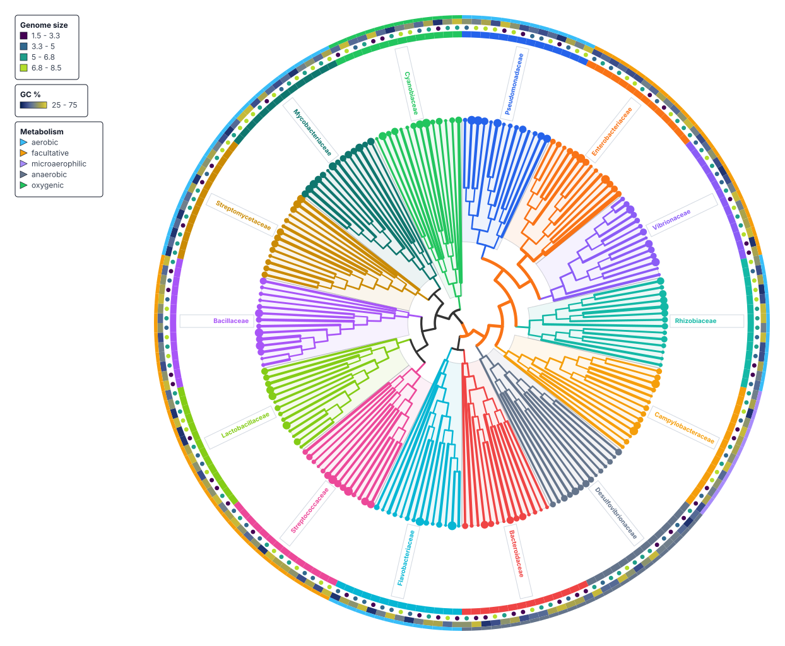

# TreeViz

[Open the browser app](https://treeviz.newlineages.com){ .md-button }
[View examples](EXAMPLES.md){ .md-button }
[GitHub](https://github.com/fmschulz/treeviz){ .md-button }

TreeViz turns a Newick, CONTree, or Nexus tree and an optional CSV or TSV table
into an interactive phylogenetic figure. Use it to inspect clades, align
metadata with leaves, compare visual encodings, and export SVG, PNG, or PDF.
Tree and metadata processing happens in the browser, without an account.

Save the complete visualization as a `.treeviz.json` session when another
person needs to reopen the tree with the same metadata binding, tracks, edits,
and view settings.

*A GTDB-derived bacterial topology with a family ring for 14 groups, genome-size symbols, GC-content shading, and metabolism categories. The displayed measurements are deterministic synthetic values; see [Examples](EXAMPLES.md#bacterial-encoding-showcase).*

## Choose a workflow

| Workflow | Use it for | Start here |
| --- | --- | --- |
| Browser app | Explore a tree, add metadata tracks, edit clades, and export a figure | [Getting started](GETTING_STARTED.md) |
| Metadata | Match table rows to leaves and choose categorical or quantitative tracks | [Prepare metadata](METADATA.md) |
| Tree styling | Control labels, branches, node marks, collapsed clades, and figure legends | [Tree styling](STYLING.md) |
| Python package | Build and validate `.treeviz.json` sessions from scripts or notebooks | [Python package](PYTHON.md) |
| Agent automation | Drive the hosted app through `window.__treeviz` and inspect diagnostics | [Agent automation](AGENTS.md) |
| Browser API | Look up methods, command arguments, and session behavior | [Browser API](API.md) |

## Start with sourced data

The [getting-started tutorial](GETTING_STARTED.md) opens a 42-species bacterial
tree derived from GTDB release R232. Its family strip uses the accompanying
taxonomy table. You can inspect the inputs, change the layout, and export the
figure without installing TreeViz.

The [example gallery](EXAMPLES.md) separates sourced biological data from
synthetic feature demonstrations and synthetic stress tests. Each catalog
entry links to its saved session, input tree, metadata, and configuration.

## Reference and troubleshooting

- [Browser app](BROWSER.md): input files, Controls, navigation, saving, and exports.
- [Exports](EXPORTS.md): figure and data formats.
- [Troubleshooting](TROUBLESHOOTING.md): metadata matching, crowded labels, wedges, and session validation.
- [Live app version](https://treeviz.newlineages.com/version.json): current deployed build.

!!! note "Public scope"
    This repository contains the public documentation, examples, issue tracker,
    and agent skill. It does not contain the browser app source or deployment
    configuration.
