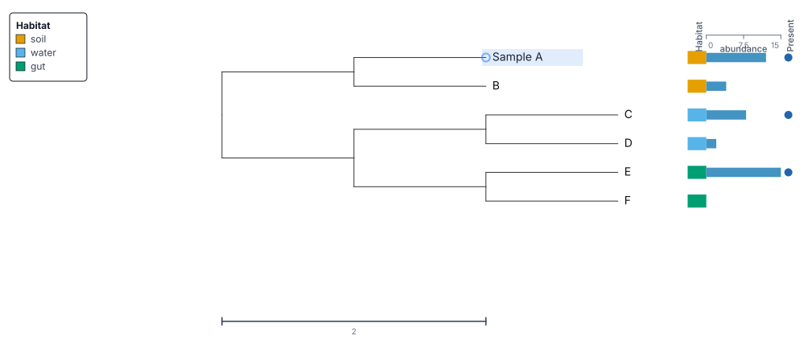

# Your first annotated tree

Build a six-leaf tree with habitat colors, abundance bars, and presence dots.
Change a leaf label, add a legend, and save a file that reopens for editing.
It runs in a web browser and needs no installation.



## 1. Open the example tree

1. Download [first-tree.nwk](data/first-tree.nwk){ download="first-tree.nwk" }.
2. Open [TreeViz](https://treeviz.newlineages.com/).
3. Click **Add Tree**, select `first-tree.nwk`, and open it. Dragging the file
   onto the page also opens it.
4. Click **Rect** above the tree, then **Fit**.

You should see six leaf labels: **A**, **B**, **C**, **D**, **E**, and **F**.
A _leaf_, also called a _tip_, is an endpoint of the tree. An internal branch
junction represents an ancestor.

The downloaded file contains this Newick text:

```newick
((A:1,B:1):1,((C:1,D:1):1,(E:1,F:1):1):1);
```

Parentheses group related leaves. The numbers after colons are branch lengths;
the semicolon ends the tree. This synthetic example is for learning the controls.

## 2. Import the metadata table

Download [metadata.csv](data/metadata.csv){ download="metadata.csv" }. It contains:

```csv
leaf_id,habitat,abundance,abundance_day2,present,display_name
A,soil,12,15,yes,Sample A
B,soil,4,5,no,Sample B
C,water,8,7,yes,Sample C
D,water,2,3,no,Sample D
E,gut,15,18,yes,Sample E
F,gut,,6,no,Sample F
```

`leaf_id` connects each row to a leaf. `habitat` is a category; the two abundance
columns are numbers; `present` records yes or no. The empty abundance cell for
F means the value is missing. `display_name` holds an alternative name to inspect
later.

1. Click **Add Tree** again and select `metadata.csv`. This button also opens
   metadata files. Keep the tree loaded.
2. In the import review, set **Row key column** to **leaf_id**.
3. Check **Preview**: it should show **6 exact**, **0 unmatched leaves**, and
   **0 unmatched rows**.
4. Leave **Goal prompt** empty and **Apply suggested tracks on import**
   unchecked. These optional suggestions are not needed for this tutorial.
5. Click **Import**.

Importing the table attaches the values to the leaves. The next steps choose
how to draw them. The equivalent [tab-separated file](data/metadata.tsv){ download="metadata.tsv" }
contains the same data. Import either format once.

## 3. Color the leaves by habitat

1. Click **Tracks** above the tree.
2. Click **+ Add Track**.
3. Set **Column** to **habitat (categorical)**.
4. Set **Kind** to **color-strip**, then click **Add**.
5. Expand the new track by clicking its title if its settings are closed.
6. Set **Title** to `Habitat`. Leave **Visible** checked and keep the default
   palette.

A and B share one color, C and D share a second, and E and F share a third.
The strip sits beside the leaves; it does not recolor the branches.

## 4. Add abundance bars and presence dots

Repeat **+ Add Track** for these two columns:

| Column                     | Kind            | Title       |
| -------------------------- | --------------- | ----------- |
| **abundance (continuous)** | **bar**         | `Abundance` |
| **present (binary)**       | **binary-dots** | `Present`   |

Expand each track to set its **Title**. For the bar track, enable **Show axis**.
E should have the longest bar, followed by A, C, B, and D. F has no abundance
value. Presence dots appear for A, C, and E.

Close **Tracks** if it covers the figure, then click **Fit**. Use the mouse
wheel or trackpad to zoom, and drag empty space to pan. See
[Add metadata tracks](../how-to/metadata-tracks.md) for gradients, heatmaps,
text tracks, and changing track widths.

## 5. Change a label

1. Right-click the leaf label **A** and choose **Rename leaf**.
2. Replace the text with `Sample A`, then press **Enter**.

The displayed name changes. The metadata already bound to that leaf stays
attached. Within this saved session, TreeViz retains the original imported
identifier for matching.

To change text size, open **Controls**, expand **Labels**, and adjust the leaf
label size. To change one label's color or size, double-click the leaf to open
its **Inspector**. See [Edit labels](../how-to/labels.md) for group labels and
crowded figures.

## 6. Put the legend in the figure

1. Click **Legend** above the tree.
2. Find the **Habitat** section.
3. Click the star button beside that section. Its tooltip is **Display in figure**.
4. Close the panel and drag the legend to an empty part of the figure.

The in-figure legend appears in image exports. The sidebar legend is a control
panel and is not part of the exported image.

## 7. Save and reopen your work

1. Click **Export**.
2. Under **Session**, click **Export Session (JSON)**. Keep the downloaded
   `.treeviz.json` file.
3. Open **Export** again and choose **Export SVG** or **Export PNG** for a figure.
4. Open TreeViz in another tab, click **Add Tree**, and select the saved
   `.treeviz.json` file.

The reopened session should contain all six leaves, the `Sample A` label, the
metadata, three tracks, and the figure legend. The original tree and CSV do not
need to be imported again.

Browser autosave is useful for continuing on the same device and browser
profile. The downloaded session is the copy to keep or move to another computer.
Other visitors cannot see your browser's previous sessions. A **Share** link
contains a copy of the session and can be opened by anyone given the complete
link.

For the next task, [highlight and collapse the C–F clade](../how-to/style-clades.md).
That guide adds a group label, a shaded background, and a collapsed wedge.
